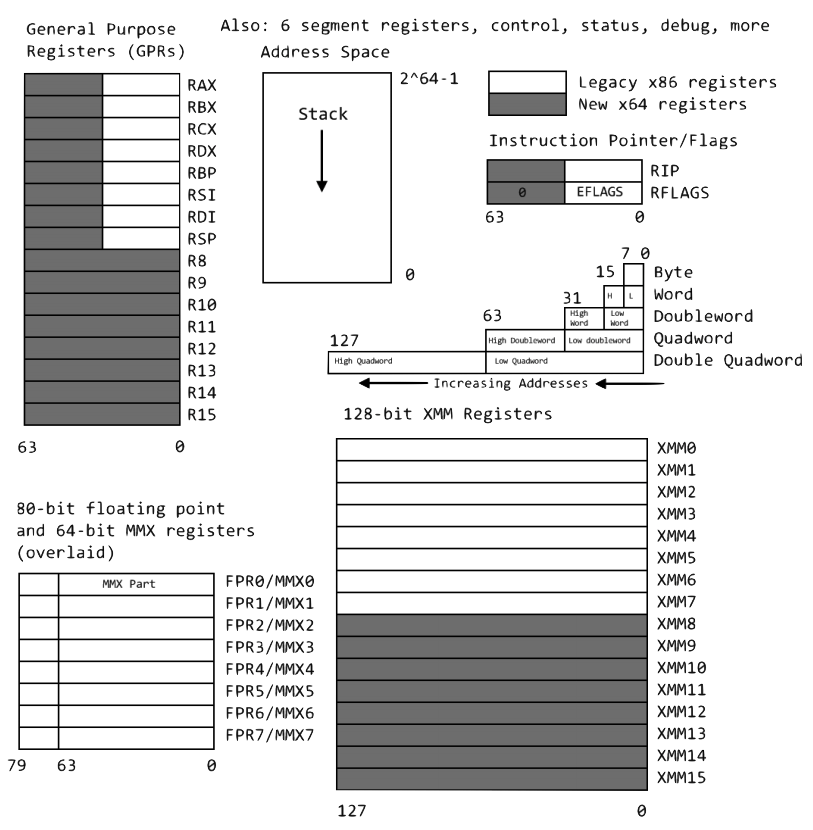
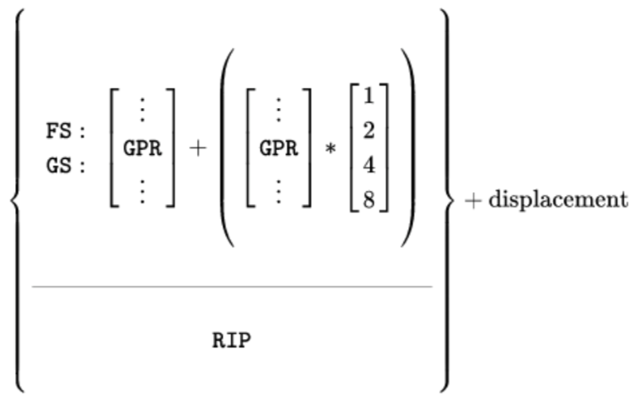
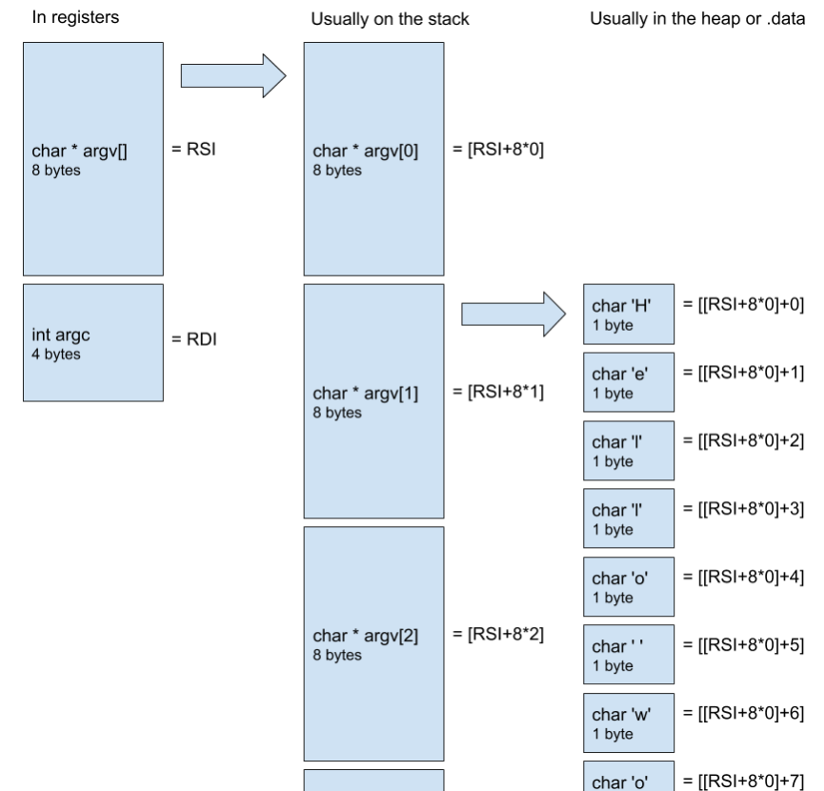
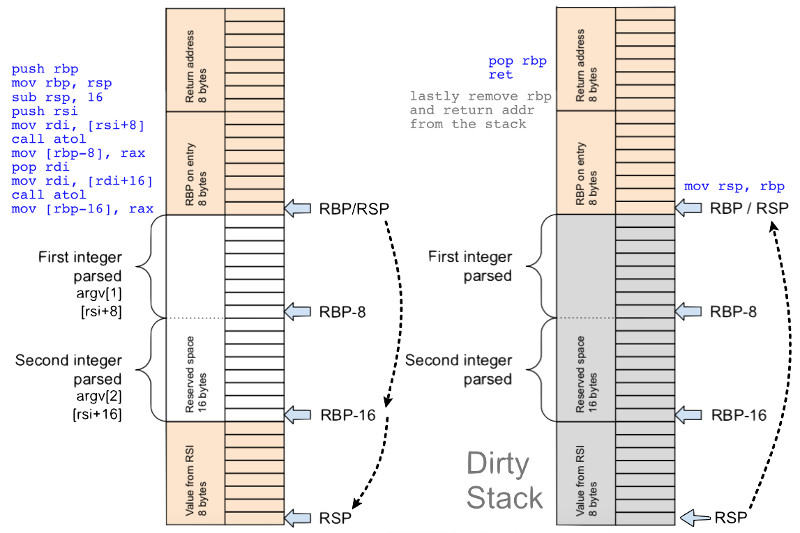

#  Lexxeous's Intel x86_64 README: 

> The **Intel** syntax was originally used in the documentation of the Intel processor and is the dialect primarily used in Windows operating systems.

### External References:

1. [Unofficial Instruction Documentation](https://www.felixcloutier.com/x86/index.html)
2. [System Calls Table](https://blog.rchapman.org/posts/Linux_System_Call_Table_for_x86_64/)
3. [System Calls Guide](https://blog.packagecloud.io/eng/2016/04/05/the-definitive-guide-to-linux-system-calls/#syscallsysret)

### General:

> The flag `-lm` refers to the `C` math library because the math functions are not part of the `C` standard library.

```bash
$ nasm -f elf64 <filename>.asm # compile assembly into 64-bit binary/object file
$ gcc -static -o <filename> <filename>.o -lm # link the binary/object file into an executable
$ ./<filename> <args> # run the executable with a set of arguments
```

> The default syntax for the `GCC` compiler is **AT&T**, but **Intel** syntax is also supported using:

```bash
$ gcc -masm=Intel -o <exec_name> <prog_name>.c
```

**Intel** chips are little-endian.

You can define single line macros with: `%define <macro_name>(<arg>) <instruction>(<arg>)`.

Using `global <func_name>` exports the contents of the file/function to be used in other compiled/linked programs.

`ld` is the default assembly linker if you are not using the `C` runtime. You can then replace the global `main` with `_start` for **Linux** or `start` for **Windows**. So compiling and linking a pure assembly program without the `C` runtime would look somthing like this: `nasm -f elf64 <file_name>.asm && ld -o <file_name> <file_name>.o`.

### Instructions:

> The source for an instruction is right hand side, while the destination is the left hand side: `<instruction> <lhs>, <rhs>` --> `<instruction> <destination>, <source>`

`test <reg_name>, <reg_name>` is a bitwise `AND` operation that will only return `0` if `<reg_name>` already contains `0`.

`xchg <reg_name> <reg_name>` is a `nop`

`ret` pops a value off the top of the stack (a call's return address) and sets the instruction pointer (`rip`) to this value. It transfers control to the return address located on the stack. **DO NOT USE** `ret` in the middle of a program, especially if you have not cleaned up the stack!

`leave` puts the base pointer (`esp`/`rsp`) back on the stack (`esp`/`rsp`).

`loop` automatically decrements the value in register `ecx`.

`mov` is effectively a copy operation like: `mov LHS, RHS`. The RHS gets copied into the LHS, while the RHS retains its original value.

`movsd` stands for "Move Static Double" and is used for moving values that are larger than 64 bits (80 bits, 128 bits (`xmm<n>`), etc.) into 64-bit registers.

`lea` stands for "Load Effective Address". This command is capable of doing quick addressing calculations and assigning the value to a register like: `lea <reg_name>, [<base> + <idx>*<scale> + displacement]`. Although assembly's bracket notation `[]` typically implies the dereference of a pointer (grabbing the data at a location, rather than the address), `lea` is an exception. 

`syscall` takes the value in `rax` to determine what system call to use. It reaches down into the kernel of the operating system (ring 0) to use a system function. It also clobbers `rcx` by saving the current value of the instruction pointer (`rip`) into it.

`hlt` is used to terminate an assembly program when it is not linked with the `C` runtime.

### External Functions:

`strtod` uses `rdi` and `rsi` as default arguments, and the result is stored in `xmm0`.

`sqrt` uses what is in register `xmm0` and stores the result in `xmm0`. You must store the original value in a secondary register (or on the stack) if you don't want to lose/overwrite it.

`printf`'s first argument by default is `rdi`. It also needs to know how many formatted items (`%f`, `%d`, `%i`, `%c`, etc...) to print, which is retrieved from `eax`. `printf` also clobbers `eax`. `printf` uses the `xmm<n>` registers as the data to print in order from `xmm0` to `xmm15`.

`puts`, by default, will write what is in `rdi`.

### Sections:

Using `section .text` denotes a section that is meant as executable code. It gets accumulated into the **code segment (CS)** of the resulting executable.

Using `section .data` denotes a section that is meant as non-executable code, but rather data that is to be used for convenience within the program. It gets accumuleted into the **data segment (DS)** of the resulting executable.

Using `section .bcc` denotes a section that is meant for modifiable data. The **Block Started by Symbol (BSS)** area is of fixed size capable of storing modifiable variables. This section is adjacent to the data segment (DS).

You can also apply properties to sections to alter the way that they behave:
  * `nowrite` appended to a `.data` section will not allow the section of memory to be written to (read-only)
  * `align=<num>` appended to a `.data` section will force the section to be aligned on a `<num>`-byte boundary

You can also use the `$` character to refer to the current memory address inline. This allows the use of small computations within a `.data` section to calculate, for example, the exact length of a string that has been statically defined. Here, the local target `.len` is being used on each of the message targets (`msg1` & `msg2`) and being set equal (`equ`) to the difference between the current memory address and the start of the immediate parent message (`$-msg<n>`).

```asm
	section .data nowrite align=16
msg1: db "string one",10
.len: equ $-msg1 ; will set msg1.len = 11
msg2: db "string2",10
.len: equ $-msg2 ; will set msg2.len = 8
```

### Registers:

> The parameter passing sequence for user-level applications when using assembly is: (`rdi`, `rsi`, `rdx`, `rcx`, `r8`, & `r9`). This means that for functions that follow the calling conventions, the first `p` parameters will be passed to these registers, in order, where `p ≤ 6`.

#### x86 16-Bit Registers:

| Name                | Abbrv. |  Aliasing  |
|:--------------------|:------:|:-----------|
| Accumulator         |   AX   | AX = AH.AL |
| Base                |   BX   | BX = BH.BL |
| Counter             |   CX   | CX = CH.CL |
| Data                |   DX   | DX = DH.DL |
| Base Pointer        |   BP   |            |
| Source Index        |   SI   |            |
| Destination Index   |   DI   |            |
| Stack Pointer       |   SP   |            |
| Instruction Pointer |   IP   |            |

#### x86 32-Bit Registers (Extended):

| Name                | Abbrv. |  Aliasing          |
|:--------------------|:------:|:-------------------|
| Accumulator         |  EAX   | EAX = (16 bits).AX |
| Base                |  EBX   | EBX = (16 bits).BX |
| Counter             |  ECX   | ECX = (16 bits).CX |
| Data                |  EDX   | EDX = (16 bits).DX |
| Base Pointer        |  EBP   |                    |
| Source Index        |  ESI   |                    |
| Destination Index   |  EDI   |                    |
| Stack Pointer       |  ESP   |                    |
| Instruction Pointer |  EIP   |                    |

#### x86_64 64-Bit Registers:

| Name                           | Abbrv.      |  Aliasing           |
|:-------------------------------|:-----------:|:--------------------|
| Accumulator                    |  RAX (R0)   | RAX = (32 bits).EAX |
| Base                           |  RBX (R1)   | RBX = (32 bits).EBX |
| Counter                        |  RCX (R2)   | RCX = (32 bits).ECX |
| Data                           |  RDX (R3)   | RDX = (32 bits).EDX |
| Base Pointer                   |  RBP (R4)   |                     |
| Source Index                   |  RSI (R5)   |                     |
| Destination Index              |  RDI (R6)   |                     |
| Stack Pointer                  |  RSP (R7)   |                     |
| General Purpose Register (GPR) |  R8         |                     |
| General Purpose Register (GPR) |  R9         |                     |
| General Purpose Register (GPR) |  R10        |                     |
| General Purpose Register (GPR) |  R11        |                     |
| General Purpose Register (GPR) |  R12        |                     |
| General Purpose Register (GPR) |  R13        |                     |
| General Purpose Register (GPR) |  R14        |                     |
| General Purpose Register (GPR) |  R15        |                     |
| Instruction Pointer            |  RIP        |                     |



#### x86_64 Segment Registers:

| Name            | Abbrv. |   Version  |
|:----------------|:------:|:-----------|
| Code Segment    |   CS   |   80286+   |
| Data Segment    |   DS   |   80286+   |
| Stack Segment   |   SS   |   80286+   |
| Extra Segment   |   ES   |   80286+   |
| General Segment |   FS   |   80386+   |
| General Segment |   GS   |   80386+   |

> There is only a subset of registers that are preserved through external function calls (`rbp`, `rbx`, `r12`, `r13`, `r14`, & `r15`). **All other registers value are not guarunteed to stay the same through calls to external functions. All other register values can potentially be clobbered.** To avoid data corruption, you must learn what registers are clobbered for certain external function calls.

`eax` (`rax`) is the default register that will be the return value for a function call.

`edi` (`rdi`), by default, contains the number of arguments passed into the function (`argc`).

`esi` (`rsi`), by default, contains a memory address pointer that points to the beginning of the argument array (`argv[]`). Effectively, is an array of `char*` datatypes, meaning that it is of type `char**`.

> **DO NOT** use `esp` as the stack pointer when doing 64-bit address computations! The register `esp` is a lingering by-product of working with 32-bit computers. If you use `esp`, it will point to an incorrect address because the upper 32 bits are not being taken into consideration.

### Addressing:



> An address in memory can be accessed using the following format: `[<base> + <index>*<scale> + displacement]`. Where `<base>` & `<index>` are registers, `<displacement>` is an integer, and `<scale>` is 1, 2, 4, or 8; `<scale>` needs to match the size of the data types your are skipping over in terms of bytes (4 for 32-bit unsigned integers, 1 for characters, etc).

> **GPR `<base>` and `<index>` sizes MUST be the same (16-bit register each, 32-bit register each, or 64-bit register each)!**

### Flags:

#### x86 16-Bit FLAGS:

| Bit#  |  Mask  | Abbrv. | Description                                  | Category |  =1                   |    =0                   |
|:-----:|:------:|:------:|:---------------------------------------------|:--------:|:----------------------|:------------------------|
|   0   | 0x0001 |   CF   | Carry                                        |  Status  | Carry (CY)            | No Carry (NC)           |
|   1   | 0x0002 |        | Reserved, always 1 in EFLAGS                 |          |                       |                         |
|   2   | 0x0004 |   PF   | Parity                                       |  Status  | Parity Even (PE)      | Parity Odd (PO)         |
|   3   | 0x0008 |        | Reserved                                     |          |                       |                         |
|   4   | 0x0010 |   AF   | Adjust                                       |  Status  | Auxiliary Carry (AC)  | No Auxiliary Carry (NA) |
|   5   | 0x0020 |        | Reserved                                     |          |                       |                         |
|   6   | 0x0040 |   ZF   | Zero                                         |  Status  | Zero (ZR)             | Not Zero (NZ)           |
|   7   | 0x0080 |   SF   | Sign                                         |  Status  | Negative (NG)         | Positive (PL)           |
|   8   | 0x0100 |   TF   | Trap                                         |  Control |                       |                         |
|   9   | 0x0200 |   IF   | Interrupt Enable                             |  Control | Enable Interrupt (EI) | Disable Interrupt (DI)  |
|   10  | 0x0400 |   DF   | Direction                                    |  Control | Down/Decrement (DN)   | Up/Increment (UP)       |
|   11  | 0x0800 |   OF   | Overflow                                     |  Status  |                       |                         |
| 12~13 | 0x3000 |  IOPL  | I/O privilege level (80286+), always 1 prior |  System  |                       |                         |
|   14  | 0x4000 |   NT   | Nested Task (80286+), always 1 prior         |  System  |                       |                         |
|   15  | 0x8000 |        | Reserved (1 on 8086 & 80186), (0 on 80286+)  |          |                       |                         |

`pushf` pushes the 16 bits of FLAGS to the top of the stack. </br>
`popf` loads 16 bits from the top of the stack into FLAGS. </br>

`lahf` moves bits 0 through 7 of FLAGS into AH. </br>
`sahf` moves AH into bits 0 through 7 of FLAGS. </br>

#### x86 32-Bit EFLAGS:

| Bit#  |  Mask       | Abbrv. | Description                          | Category |
|:-----:|:-----------:|:------:|:-------------------------------------|:--------:|
|   16  | 0x0001_0000 |   RF   | Resume (80386+)                      |  System  |
|   17  | 0x0002_0000 |   VM   | Virtual 8086 Mode (80386+)           |  System  |
|   18  | 0x0004_0000 |   AC   | Alignment Check (486SX+)             |  System  |
|   19  | 0x0008_0000 |  VIF   | Virtual Interrupt (Pentium+)         |  System  |
|   20  | 0x0010_0000 |  VIP   | Virtual Interrupt Pending (Pentium+) |  System  |	
|   21  | 0x0020_0000 |   ID   | Can use CPUID (Pentium+)             |  System  |
| 22~31 | 0xFFC0_0000 |        | Reserved                             |  System  |

`pushfd` pushes the 32 bits of EFLAGS to the top of the stack. </br>
`popfd` loads 32 bits from the top of the stack into EFLAGS. </br>

#### x86_64 64-Bit RFLAGS:

| Bit#  |  Mask                 | Abbrv. | Description                | Category |
|:-----:|:---------------------:|:------:|:---------------------------|:--------:|
| 32~63 | 0xFFFF_FFFF_0000_0000 |        | Reserved                   |          |

`pushfq` pushes the 64 bits of RFLAGS to the top of the stack. </br>
`popfq` loads 64 bits from the top of the stack into RFLAGS. </br>


### Command Line Arguments: `argv[ ]` & `argc`



> **The last column is slightly wrong, it should be `[[rsi+8*1]+n]` to access the first string argument, which in this case is "Hello world"**

### Stack Management:

In general, the boiler plate instructions for conserving the state of the stack, before and after the actions of a program are:

```asm
push rbp
mov rbp, rsp
;
; body
;
mov rsp, rbp ; this line and
pop rbp ; this line can be replaced with "leave"
ret
```

#### Reserving Specific Amounts of Space on the Stack

For the majority of assembly programs, a call to a function will push the return address (8 bytes) onto the stack and push `rbp` (8 bytes) onto the stack. If this is the case, then the stack will be aligned on a 16-byte boundary automatically. However, there will be problems if the stack is not aligned on a 16-byte boundary when a call to another function occurs that uses an `xmm<n>` register (it will cause a segmentation fault).

Fortunately, if a function call does not use an `xmm<n>` register, then you needn't worry about aligning the stack.

There are two main ways to properly allocate space on the stack (after knowing the minimum amount of space needed): <br>

1. Say you only need 24 bytes of space on the stack for a program (for storing three 8-byte register values). The value 24 is not a multiple of 16 and will not align the stack, in most cases. The easiest solution is to round up to the nearest multiple of 16 (32, in this case), and subtract that value from the stack pointer (`rsp`), like: `sub rsp, 32`.
2. A nearly identical solution that will reveal the intentional amount of space that is desired on the stack is to first move the stack pointer with: `sub rsp, 24`, then to zero-out the last nybble of the stack memory. Aligning the stack on a 16-byte boundary means that all the addresses that are aligned will end with the hexidecimal digit `0x0`. The way to achieve this, regardless of the stack pointer's location, is to `AND` the current value of the stack pointer with -16, like: `and rsp, -16`. Because 16 in binary is `0000_..._0001_0000`, the 2's complement representation (-16) is `1111_..._1111_0000`. Effectively, this instruction will leave the stack unchanged except for the last nybble (`AND`-ed with zeros), which will be cleared; this forces the stack pointer address to end with `0x0`.

> For these two options, the flags are also set a bit differently. The `AND` instruction leaves the `AF` flag undefined, clears the `CF` and `OF` flags, sets `PF` if the low byte of the result has odd parity, sets `SF` if the result is negative (viewed in two's complement), and sets `ZF` if the result is zero.

> The `sub` instruction evaluates the result for both signed and unsigned integer operands and sets the `OF` and `CF` flags to indicate any overflow in the signed or unsigned result, respectively. The `AF` flag is set based on whether the first nybble overflows. The `SF` flag indicates the sign of a signed result.

The image below provides an example of stack management with a program that seeks to store two 8-byte arguments and the register `rsi` on the stack. Implicitly, the return address for this call has been placed on top of the stack first. The base pointer register `rbp` is pushed, aligning the stack. When 16 is subtracted from the stack pointer (`rsp`), the stack remains aligned with space for the two arguments. When `rsi` is pushed to the stack, it becomes unaligned. Fortunatly, `atol` does not use any `xmm<n>` registers, so calling the function is inconsequential to the state of the stack (with regards to alignement). Once the program is almost finished, and has no more need for the stack, the stack pointer (`rsp`) is returned to the location of the base pointer (`rbp`) with: `mov rbp, rsp`. From this point, all there is left to do is pop the base pointer and return (`ret`); returning will pop the return address and place it in the instruction pointer register (`rip`).



> There is a security issue related to moving the stack pointer to the base pointer location, once the stack is no longer of use. If the stack values are not cleared, the stack becomes "dirty". These raw data values are left unattended and can cause data leakage. For most programs this won't be an issue, but for any important values that are stored on the stack, malicious users can look through the stack after a process, and steal valuable information. One common way to clear the stack is to implement a subroutine that will increment the address of the stack pointer (`rsp`) until it is equal to the address of the base pointer (`rbp`), clearing each byte along the way.

### Inline Assembly:

> The syntax for inline assembly mostly follows the same rules as the parent syntax (i.e., **Intel** or **AT&T**), and the compiler used, so check for compatibility before barging in. The following documentation will be for **Intel Assembly** and the `GCC` compiler.

Inline assembly code can be used with `GCC` and other compilers, as long as the language and the hardware system supports it. In some cases, programmers use inline assembly blocks to prohibit the compilers from making automatic optimizations to thier code (which could otherwise break some code that they wrote intentionally, e.g., for loop delay function with no actionable instructions nested in the middle).

> Keywords like `asm`, `typeof`, `volatile`, & `inline` may not available in programs compiled with `-ansi` or `-std` (although `inline` can be used in a program compiled with `-std=c99` or a later standard).
The way to solve these problems is to put a double underscore (`__`) at the beginning and end of each problematical keyword. For example, use `__asm__` instead of `asm`, and `__inline__` instead of inline.

Creating an inline assembly code block in `C` is fairly simple, but gets more complex when dealing with details:

```c
__asm__ (
  "assembly code" // all assembly code lines are strings and will end with a new line character ('\n')
  "comes first" // all sections are separated by a colon character (':')
  : outputs // the "outputs" and "inputs" sections connect values from a C program to registers
  : inputs
  : clobbers // the "clobbers" section identifies the registers that will be changed (clobbered)
)
```

> ***The syntax for connecting the outputs and inputs between the `C` program and the assembly can be very cryptic; you will need to follow constraints mentioned [here](https://gcc.gnu.org/onlinedocs/gcc/Using-Assembly-Language-with-C.html).***

As an example, below is a `C` code sample that includes inline assembly.

```c
// gcc -c -m32 -masm=intel main.c && gcc -o main main.o -m32 -masm=intel

#include <stdio.h>

int main(void) {
	int value = 17;
	int incr = 12;
	printf("value=%d and incr=%d\n", value, incr);

	__asm__(
		"mov eax, %[value]\n"
		"add eax, %[incr]\n"
		"mov %[value], eax\n" // instructions
		: [value] "=r"(value) // outputs <value> in eax
		: "0"(value), [incr] "r"(incr) // inputs <value> into eax, and <incr> into any general purpose register
		: "eax", "cc" // clobbers eax and condition FLAGS
	);

	printf("value=%d and incr=%d\n", value, incr);
	return 0;
}
```

### Using and Starting the `C` Runtime:

In `C` the `libc_start_main` function is very important for starting the `C` runtime. Because of its specific order of parameters and its use in conjuction with assembly, there is a fairly strict order of assembly instructions that will successfully start this function with the correct values. Below is the function definition for `__libc_start_main`, the order of parameters (based on the assembly calling convention), and a mapping to the list of instructions (and memory addresses) associated with the assembly necesary to properly use this function.

```c
// Function definition:             // ASM Convention:   // ASM Instruction (Address) Map:
int __libc_start_main (             // call              // 11 (0x67f8)
  int* (main)(int, char**, char**), // rdi               // 10 (0x67f1)
  int argc,                         // rsi               // 03 (0x67d9)
  char** ubp_av,                    // rdx               // 04 (0x67da)
  void (*init)(void),               // rcx               // 09 (0x67ea)
  void (*fini)(void),               // r8                // 08 (0x67e3)
  void (*rtld_fini)(void),          // r9                // 02 (0x67d6)
  void (*stack_end)                 // stack             // 07 (0x67e2)
);
```

> The instructions shown are from the disassembly of the `ls` instruction for **Unix**.

```txt
Initial Stack Contents:
    <–––– rbp
argc
argv[]
envp (for <ubp_av>)
    <–––– rsp
```

```asm
00 (0x67d0): endbr64                ; branch protection, nop
01 (0x67d0): xor ebp, ebp           ; clear ebp
02 (0x67d0): mov r9, rdx            ; addr of destructor function call for dynamic linker _dl_fini
03 (0x67d0): pop rsi                ; pops argc of the top of the stack into rsi
04 (0x67d0): mov rdx, rsp           ; moves rsp addr to rdx (for <ubp_av>)
05 (0x67d0): and rsp, -16           ; aligns stack on 16-byte boundary
06 (0x67d0): push rax               ; couldve pushed rsp twice
07 (0x67d0): push rsp               ; aligns stack on 16-byte boundary (for <*stack_end>)
08 (0x67d0): lea r8, [rip+0x10d66]  ; (for <*fini>)
09 (0x67d0): lea rcx, [rip+0x10cef]            ; (for <*rtld_fini>)
10 (0x67d0): lea rdi, [rip+0xffffffffffffe5f8] ; (for int* (main))
11 (0x67d0): call QWORD PTR [rip+0x1c7d2]      ; (for call to __libc_start_main)
12 (0x67d0): hlt                               ; (_start needs sys_exit)
```
> In general, these 12 lines of code can be copied almost exactly for any assembly program that wants to make a direct call to the `C` runtime. The main differences will only be in the immediate values given to the addressing computations on lines 8 through 11.

### Jump Tables:

A common structure that can implemented in `C` is a *switch* statement, and it uses the following structure:

```c
switch(n) {
	case 0: f(); // execute function f() if n = 0
	case 1: g(); // execute function g() if n = 1
	case 2: h(); // execute function h() if n = 2
	...
	case N: N(); // execute function N() if n = N 
	default: j(); // execute function j() if n != [0..N]
}
```

In assembly, this structure can be implemented fairly easily by building a *jump table* with a list of targets like:

```asm
section .data
jumptab: dq target_f, target_g, target_h, ... , target_N

section .text
	; ...
	cmp rax, N ; rax should contain the input 'n'
	ja .def ; jump if above to the default target
	jmp [jumptab+rax*8] ; else jump to the jump table (list of targets, indexed by rax)
.def
	jmp target_j

target_f:
	; ...
	jmp switch_done

target_g:
	; ...
	jmp switch_done

target_h:
	; ...
	jmp switch_done

  ...

target_N:
	; ...
	jmp switch_done

target_j:
	; ...
	jmp switch_done

switch_done:
	; ...
```

### Using `objdump` and `readelf` (`gobjdump` for macOS):

Both `objdump` and `readelf` use the same general format in the terminal:

```bash
$ objdump [flags] <file_name>
$ readelf [flags] <file_name>
```

Useful `objdump` flags (use `man objdump` for more information):

  * `-d` or `--disassemble` (disassembles only sections that are expected to contain instructions)
  * `-F` or `--file-offsets` (shows the file offset values when disassembling sections)
  * `-f` or `--file-headers` (shows summary info from each parent header)
  * `-j` (shows only a user specified list of sections during disassebmly)
  * `-M` or `--disassembler-options` (allows disassembler configuration for syntax, architecture, etc.)
  * `-s` or `--full-contents` (shows full contents of any section(s) requested)
  * `-t` or `--syms` (shows the symbol table)

Useful `readelf` flags (use `man readelf` for more information):

  * `-f` or `--file-headers` (shows summary info from each parent header)
  * `-s` or `--full-contents` (shows full contents of any section(s) requested)
  * `-S` or `--source` (intermix source code with disassembly)
  * `-t` or `--syms` (shows the symbol table)

> If you want to use a tool that is similar to `readelf` for **macOS**, use `brew install binutils` and follow the resulting instructions about adding the tools directory to your PATH and setting environment variables. Then you can use `gobjdump` like:

```bash
$ temp_path=`which <exec_name>`
$ gobjdump [flags] $temp_path
```

For `<exec_name>` = `make` and `[flags]` = `-s`:

```bash
$ temp_path=`which make`
$ gobjdump -s $temp_path
```
```txt
/usr/bin/make:     file format mach-o-x86-64

Contents of section .text:
 100000f77 554889e5 8d47ff48 8d560848 8d3d2900  UH...G.H.V.H.=).
 100000f87 000031c9 89c6e800 000000             ..1........
Contents of section __TEXT.__stubs:
 100000f92 ff257800 0000                        .%x...
Contents of section __TEXT.__stub_helper:
 100000f98 4c8d1d69 00000041 53ff2559 00000090  L..i...AS.%Y....
 100000fa8 68000000 00e9e6ff ffff               h.........
Contents of section .cstring:
 100000fb2 6d616b65 00                          make.
```


