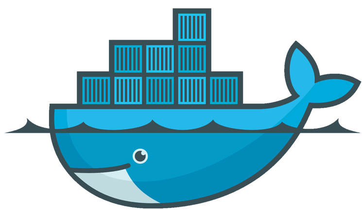
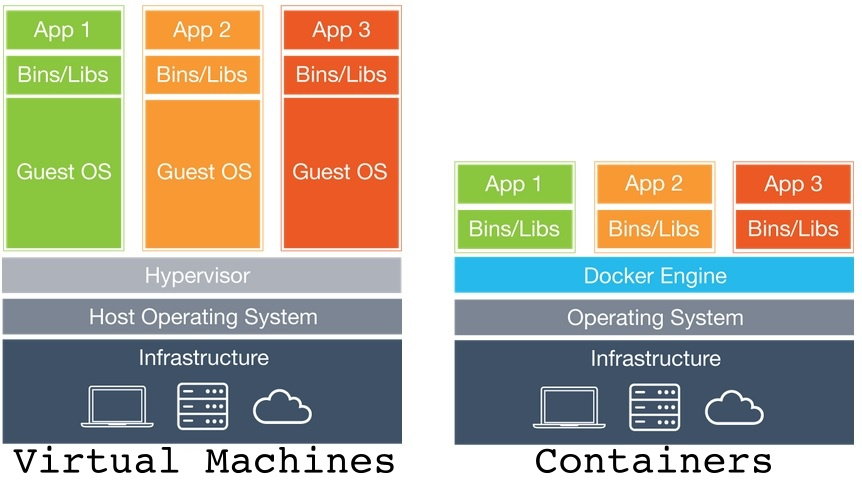
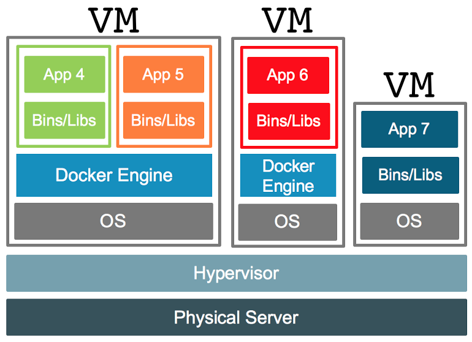

<!-- Docker Management -->

#  Lexxeous's Docker Management: 

> Credit to freeCodeCamp for providing the [Docker Tutorial for Beginners - A Full DevOps Course on How to Run Applications in Containers](https://www.youtube.com/watch?v=fqMOX6JJhGo) YouTube video tutorial.

> For additional, hands-on practice with **Docker**, you can access free labs from KodeKloud [here](https://beta.kodekloud.com/lessons/hands-on-labs/).

## Summary:

**Docker** is a containerization platform that allows the creation and isolation of software applications. Rather than having to worry about a plethora of dependencies and compatible operating systems for an application, **Docker** allows you to separate the components of your application into managable pieces. Take a website, for example. For a simple website you may need to use things such as `NodeJS` with hosting as your web server, `MongoDB` or `SQL` for your database, `Redis` for your messaging system, and `Ansible` for application orchestration. All of these different components may require different lihraries, dependencies, operating systems, development/test/production environments, and hardware infastructure to run together properly. This can easily cause a complicated mess when trying to run all of these services as one large application.

**Docker** however allows interoperability of these components as microservices. Each of these components will become its own container, complete with its own set of internal dependencies, not dependent on one another or the underlying OS, but rather sharing an OS kernel. This means that any Linux container can run with any Linux Docker installation, Windows with Windows, & MacOS with MacOS. Furthermore, it is possible to run a Linux container on a Windows OS, for example, but under the hood, Docker creates a Linux kernel VM that runs in coordination with the Windows OS and hardware.

## Containerization vs. Virtualization:

# 

The image above gives a pictoral representation on how containerization differs from virtualization. Using a containerization platform like **Docker** allows for applications to have a much smaller footprint, as they can share the same OS kernel underneath. This is different from VMs in the fact that VM requires its own guest OS to run on top of the host OS, creating larger and more complex applications. Using containerization instead of virtualization will automatically cut down on CPU utilization, boot up time, and necessary disk space for the same set of running applications.

# 

In larger enterprise environments, it is also common to use both containerization and virtualization together. This allows a hypervisor to manage different types of virtual machines with different host operating systems, while the containerization environment runs necessary applications on top of different shared OS kernels. These types of configurations can be very powerful.

## To DevOps:

Traditionally, developers would create an application and a list of instructions on how to set up the application for the operators to deploy on some hardware. These instructions contained things like necessary software lihraries, dependencies, configuration, etc. When the operators struggled to deploy the application to production, they would have to backtrack and work with the developers to solve the issue, considering that the operators themselves did not develop the application. With **Docker**, the development process changes. Rather than sending an application and a list of instructions on how to depoy the application manually, **Docker** allows the use of images and `Dockerfile`s as a alternative. The **Docker** image is a self-contained entity that already provides all of the necessary lihraries, dependencies, configurations, and other requirements needed to build/deploy an application on top of any hardware infastructure and OS. In this way, the developers and the operators are combined in to a team commonly known as *DevOps*, changing the landscape of application deployment. With **Docker**, building and deploying an application is as simple as aquiring the **Docker** image and running the `Dockerfile` in the desired location.

## Commands:

</hr>

#### Run:
> If the image does not exist locally, **Docker** will automatically pull the image from a remote location and use the local image for any subsequent runs.
```bash
$ docker run [OPTIONS] IMAGE[:TAG] [COMMAND] [ARG...] # run container from a Docker image

	# Use the `-d` (detach) option to run a container in the background.
	# Use the `-p <host_port>:<container_port>` (publish) option to bind a host port to an exposed container port.
		# Specify a prefixed IP address with `<IP>:<port>`
		# Specify a range of ports with `<start_port>-<end_port>`; quantity of ports in range must be the same for both host and container
		# Specify a protocol to use with `<port>/tcp` or `<port>/udp`
	# Use the `-i` (interactive) option to map the host stdin to the container's stdin.
	# Use the `-t` (terminal) option to allocate a pseudo-TTY from the container to the host.
	# Use the `-v` (volume) option to map volume data with `<host_path>:<container_path>`.
	# Use the `-e` (env) option to input a list of environment variables with `<VAR_NAME>=<val>`.
	# Use the optional `[:TAG]` to specify an image version (default is "latest")
```

</hr>

#### Push:
>
```bash
$ docker push [OPTIONS] NAME[:TAG] # push image or repo to a remote registry
```


</hr>

#### Pull:
> This command is automatically run with `$ docker run` if the image is not found locally. You can use this command on its own if you only want to retrieve the image without also creating a container instance.
```bash
$ docker pull [OPTIONS] NAME[:TAG|@DIGEST] # pull a Docker image from a repo or registry
```

</hr>

#### Build:
> This command is used to build a containerized, Dockerized image from a `Dockerfile`. In many cases, the `PATH` will just be the current working directory or the location of the `Dockerfile`, which would be `.` or `pwd`. It is good practice to put a comment at the top of your `Dockerfile` to specify what the build command should be for each **Docker** project.
```bash
$ docker build [OPTIONS] PATH | URL | - # build a Docker image from a Dockerfile
	# Use the `-t` (tag) option to specify a project name path like `<username>/<proj_name>`.
	# Use the `-f` (file) option to specify the name of your Dockerfile.
		# By default, the path to the Dockerfile is already set to 'PATH/Dockerfile'.
```

</hr>

#### History:
> This command allows you to view the detail of how a specific **Docker** image was built.
```bash
$ docker history [OPTIONS] IMAGE # show the history of a Docker image
```

</hr>

#### Process Status:
> Prints container information such as the container ID, the image name, the current internal process command, the creation date, the current status, the ports used, and the alias name.
```bash
$ docker ps [OPTIONS] # list containers

	# You can use the `-a` (all) option to list all containers (both running and stopped).
```

</hr>

#### Inspect:
> This command can return much more details about a **Docker** object/container than `$ docker ps`.
```bash
$ docker inspect [OPTIONS] NAME|ID [NAME|ID...] # return low-level Docker object info in JSON format
```

</hr>

#### Logs:
> If you dont have a container running in interactive mode with `-i`, attached to a pseudo-TTY with `-t`, or printing logs to an internal or external volume log file, you can use this command to fetch the container's `stdout`.
```bash
$ docker logs [OPTIONS] CONTAINER # get the stdout logs from a specific container
```

</hr>

#### Start:
> This command allows you to start up an already existing **Docker** container after it has been stopped (after acquiring an exit status). A **Docker** image will have created a container instance with a specific, randomized alias name. Use this command to "boot up" a pre-existing instance rather than using `$ docker run`. Using `$ docker run` will simply create a brand new container instance from the **Docker** image.
```bash
$ docker start [OPTIONS] CONTAINER [CONTAINER...] # start one or more stopped containers
```

</hr>

#### Stop:
> To stop a specific container you can use either the container ID or the alias name. This command will stop a container from running. You can start up the container again (rather than creating another container instance from an image) by using `$ docker run [CONTAINER_ID | ALIAS_NAME]`.
```bash
$ docker stop [OPTIONS] CONTAINER [CONTAINER...] # stop a running Docker container instance
```

</hr>

#### Remove:
> To remove a specific container you can use either the container ID or the alias name. This command will simply remove the container instance, not delete the **Docker** image used to create the associated container instance.
```bash
$ docker rm [OPTIONS] CONTAINER [CONTAINER...] # remove a specified Docker container instance
```

</hr>

#### Images:
> Lists local **Docker** images that can be immediately used to create container instances.
```bash
$ docker images [OPTIONS] [REPOSITORY[:TAG]] # list available, local Docker images
```

</hr>

#### Remove Image(s):
> Removes one or more local **Docker** images. First, ensure that there are no container instances running off of the image(s) to be removed.
```bash
$ docker rmi [OPTIONS] IMAGE [IMAGE...] # remove one or more Docker images
```

</hr>

#### Execute:
> While a specific **Docker** container instance is running, you can pass commands to it. It will then run these commands as internal processes. When a container no longer has any internal processes to run, the container instance will exit/halt/stop. 
```bash
$ docker exec [OPTIONS] CONTAINER COMMAND [ARG...] # execute a command in a running container instance
```

## Dockerfiles:

> The following steps represent a guide for the ordered, layered architecture required for `Dockerfile`s:

1. All "commands" inside of a `Dockerfile` follow a simple `INSTRUCTION ARGUMENT` format.
2. All `Dockerfile`s must start with a `FROM` instruction that specifies a base OS or another environment image.
3. Install necessary dependencies for your **Docker**ized application to run.
4. Copy any required source code (current directory or otherwise) to a specific destination in the container's file system.
5. Specify an internal command as the entry point for the container to use when it is run.

> The build layers of a `Dockerfile` are cached in the host's memory during the build process. If any such layer should fail during the process, you can fix the problem and rerun the same build command without **Docker** needing to start the entire build process over from the beginning. The same is true for updating steps in the **Docker** image build. These benefits are provided automatically without additional effort.

```dockerfile
FROM #comment

RUN

COPY

EXPOSE

WORKDIR

ENTRYPOINT

```

### Misc:

  * By default, **Docker** containers run in an uninteractive mode and do not listen to `stdin`.
    - Use `-i` with `$ docker run` to run a **Docker** container in interactive mode.
    - Use `-t` with `$ docker run` to attach the **Docker** container terminal's `stdout` to the host's.
  * With `$ docker inspect` you can find all of the environment variables that a particular running container is using under the `["Config"]["Env"]` index of the `JSON` output.


