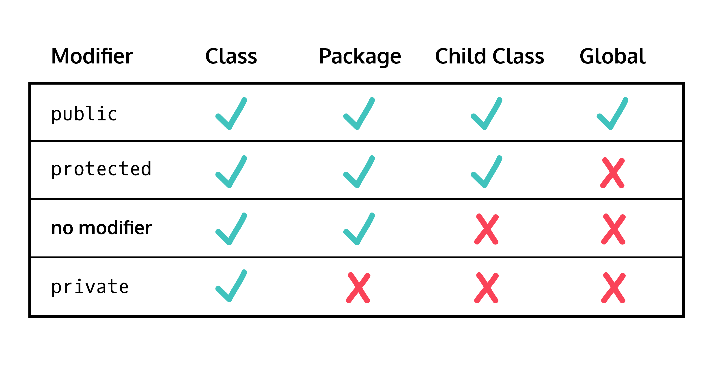

<!-- Java Management.md -->

#  Lexxeous's Java Management: 

> Tutorial content credit goes to the [Codecademy Java Tutorial](https://www.codecademy.com/courses/learn-java).

### Manage Java Projects:

A Java program is essentially a collection of 1 or more Java files that have classes, `main` functions, and supplementary functions.
Upon executing a particular file, the `main` function will be called. The functionality depends on the other functions that are called within the `main` and the other files that are included for the primary class to reference.

```java
javac <filename>.java // creates a <filename>.class file to be executed
java <filename> // executes the <filename>.class "main" function
```

### Unchecked or Unsafe Operations:

The following warning is displayed when you execute code which the Java compiler considers to be lacking in error-checking, or is potentially unsafe in some way.

```bash
Note: <filename>.java uses unchecked or unsafe operations.
Note: Recompile with -Xlint:unchecked for details.
```

This warning can also come up in Java 5 and later if you're using collections without type specifiers (e.g., `Arraylist()` instead of `ArrayList<String>()`). It means that the compiler can't check that you're using the collection in a type-safe way, using generics. <br>

This warning can be suppressed or fixed by using the `-Xlint` flag.

```java
// You can use the flag in this format to check the lines that Java beleives to be unsafe, and fix them.
javac -Xlint:unchecked <filename>.java

// You can use the flag with this format to suppress the warning and compile the Java code, despite the warning.
javac <filename>.java -Xlint
```

### Inheritance Access Modifiers:

