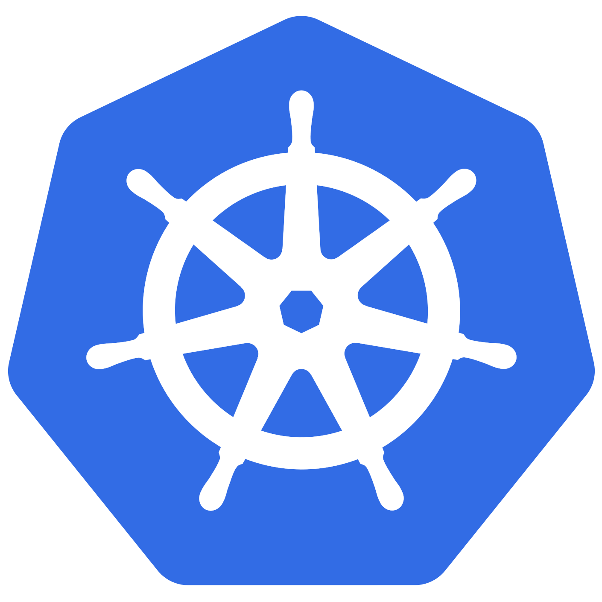

<!-- Docker Management -->

#  Lexxeous's Kubernetes Management: 

> Credit to "TechWorld with Nana" for providing the [Kubernetes Tutorial for Beginners](https://www.youtube.com/watch?v=X48VuDVv0do) YouTube video tutorial.

## 1. Summary:

**Kubernetes** (K8s) is an open-source container orchestration tool/framework, originally developed by *Google* in 2015. This means that **K8s** helps manage applications that consist of a few to a few thousand containers. The ability to host an application with an arbitrary number of containers came from the transition from monolith to microservice based applications. Breaking up large/enterprise scale applications into smaller pieces allowed developers to better organize and abstract the application itself, without compromising functionality, while increasing efficiency (after transient start up cost).

## 2. Kubernetes Benefits: 

1. <ins>*Deployment:*</ins> This benefit category refers to conveniences provided by the **Kubernetes** platform to get applications “up and running”. It is known to increase productivity, extend portability, allow custom automation scripts, remove the tedium of excessive manual tasks, and streamline container workflow, in an effective way.

1. <ins>*Availability:*</ins> This benefit category refers to **Kubernetes**’ ability to guarantee high levels of reliability for deployed applications. The primary property that supports this benefit is automatic load-balancing. Allowing container replicas to move workloads between themselves decreases unnecessary workloads on any one container, improving the longevity of the entire group.

1. <ins>*Cloud Service Integration:*</ins> This benefit category refers to the options of deploying **Kubernetes** applications in different locations. Many of the top cloud service providers offer **Kubernetes** support including Microsoft’s Azure **Kubernetes** Service (AKS), Google’s **Kubernetes** Engine (GKE), and Amazon’s Elastic **Kubernetes** Service (EKS). This means that **Kubernetes** applications can be deployed completely on-premise or in hybrid/multi-cloud environments.

1. <ins>*Configuration Management:*</ins> This benefit category refers to the customization options that are available for distributed container deployments. **Kubernetes** uses YAML files to specify replica count, metadata, volume locations, ephemeral storage capacities, memory and CPU limits, and API versions, among many other things.

1. <ins>*Community-driven:*</ins> This benefit category refers to **Kubernetes**’ excessive use and presence in a relatively short amount of time. It is popular, open-source, actively maintained, and well documented. **Kubernetes** is just another example to support the success of software that is completely accessible to the public for development.

1. <ins>*Optimal Resource Utilization:*</ins> This benefit category refers to **Kubernetes**’ ability to automatically scale horizontally, increasing and decreasing the amount of container replicas, based on the value(s) of specified metric(s). As a result, this feature can optimize resource footprints dynamically by reducing the use of unnecessary resources.

1. <ins>*Self-healing:*</ins> This benefit category refers to automatically reviving container replicas upon failure. This is another feature that assists in ensuring high availability of deployed applications. **Kubernetes** can sense when a replica has failed and it able to restore it with the desired configurations.

## 3. Kubernetes Challenges:

1. 

<ins>*Monitoring & Logging:*</ins> This challenge category refers to the task of attempting to monitor and log the health and state information of many different distributed, containerized applications at once. Some of the issues can be alleviated by using 3rd party monitoring tools like Prometheus, instead of using the default functionality.

1. <ins>*Security Practices:*</ins> This challenge category refers to the issues when attempting to ensure secure configurations and security policies across all server clusters. Although **Kubernetes** includes some default security tools, like Role Based Access Control (RBAC) functionality, the current software versions of **Kubernetes** are being consistently updated. Patch support is removed after the 3rd minor release, as deemed by the **Kubernetes** documentation . This challenge category also refers to the inclusion of 3rd party security software like Istio.

1. <ins>*Maintenance:*</ins> This challenge category refers to the persistence of changes to the platform which also govern the need to moderate already deployed applications. Whether the official development team or open-source community releases a new vulnerability or feature patch, compatibility issues are bound to occur. Despite **Kubernetes** automation, replication, and orchestration benefits, deployed containers may not be running as securely or as effectively as they could without updated software.

1. <ins>*Susceptibility to Attacks:*</ins> This challenge category refers to the inherent scalability property of the **Kubernetes** platform. Even though some containerized applications may have custom configurations that make them differ from their counterparts, replicated applications share many of the same advantages and defects. As a result, scaling applications easily may be a benefit, but increasing the size of your organization’s attack surface is a clear disadvantage.

1. <ins>*Migration Costs:*</ins> This challenge category refers to the initiation price of using **Kubernetes**. While the platform promises and delivers “easy” container orchestration, compared to manual deployment of individual containers, there is a transient cost associated with “making the switch”. Time, hardware resources, monetary resources, software development changes, and necessary domain knowledge are all potential areas of concern for an organization adopting **Kubernetes** as their primary application deployment platform.

1. <ins>*Hardware Interoperability:*</ins> This challenge category refers to the inferiority of certain hardware and bare-metal systems with regards to supporting the **Kubernetes** architecture. Jeff Geerling alluded to this problem in one of his blogs where he mentions his niche problems running **Kubernetes** on a cluster of Raspberry Pis, due to the default Raspbian Operating System (OS) using an ARM32 architecture. Some Docker containers will not have compatibility with this architecture until a Raspbian ARM64 OS version is released.

1. <ins>*Troubleshooting:*</ins> This challenge category refers to the effort spent “converting” previously built containers and applications to work properly with the **Kubernetes** platform, before redeployment. **Kubernetes** offers a plethora of configuration options to the user, given that it uses an Infrastructure as Code (IaC) paradigm. Even if an organization already has Docker containers deployed for their running applications, migrating their functionality to **Kubernetes** still represents a challenge. This challenge has been softening with the initial release of Kompose v1.0.0, in July of 2017.

1. <ins>*Testing:*</ins> This challenge category refers to the “effort” spent confirming proper operation of a **Kubernetes** application after “conversion”. Valid unit and end to end testing is paramount to avoid buggy deployment.

1. <ins>*Performance:*</ins> This challenge category refers to the responsiveness of deployed applications. For a variety of reasons, even distributed containerized applications may not be able to “keep up” with influxes of incoming network traffic or may suffer from network latencies due to necessary container-to-container communications, despite **Kubernetes** load-balancing abilities.

1. <ins>*Storage:*</ins> This challenge category refers to the decisions and configurations necessary to use **Kubernetes** default storage systems or to outsource the responsibility to a cloud service provider like Amazon Web Services (AWS). Given **Kubernetes**’ ephemeral property of on-disk files, it may be beneficial for an organization to outsource their storage needs, rather than risking the loss of information due to an unpredictable container failure.

1. <ins>*Networking:*</ins> This challenge category refers to the necessity of linking containers together for potential inter-process communications. Access permissions and network policies also need to be configured correctly to ensure isolation of possible network attacks.

1. <ins>*Idempotency:*</ins> This challenge category refers to the lack of consistency replicated containers may experience. Although the container replicas may be largely the same, necessary unique differences, via custom configurations, may incur confusion about how the replicas need to interact with each other and with other deployed applications.

1. <ins>*Environment Customization:*</ins> This challenge category refers to the inevitable differences between situations in which **Kubernetes** is used. Regardless of the best practices and the conveniences, provided by the platform, **Kubernetes** is a generalized tool and still requires custom considerations and configurations for every different situation.

1. <ins>*Learning Curve:*</ins> This challenge category refers to the innate complexity of the **Kubernetes** platform. Especially for developers that are new to the world of containerized applications, learning **Kubernetes**, and all that it has to offer, is no trivial feat. Uncompressed, the **Kubernetes** master branch  is over 250MB in size, has over 96,000 commits, and has over 22,500 files. Navigating even a subset of this codebase and its documentation is a tall order.

## 4. Kubernetes Components:

### Nodes:

A *node* represents a physical or virtual server/machine for **Kubernetes** to run on. 

### Pods:

> A single *pod* will typically only run a single container inside of it. While it is possible to run multiple containers inside of a *pod*, its not as commmon.

This is the smallest wrapper unit available in **Kubernetes**. It represents an abstraction over a container. This abstraction allows developers to strip away the need to interact directly with a containerization runtime, and only interact with the high level **Kubernetes** layer.

By default, **Kubernetes** provides a virtual network for *pods*; each *pod* gets is own unique internal IP address when it is created.

### Services:

This component applies a permenant/static IP address for *pods* that persist through failures and restarts.

1. <ins>*External Service:*</ins>
	External services have addresses like `http://<my-app-IP>:<port>` for the main application/website that communicates with the internal services.

1. <ins>*Internal Service*</ins>
	Internal services have addresses like `http://<internal_service-IP>:<port>` for the "helper" *pods* that assist the main *pod*.

### Ingress:

This component allows the forwarding/mapping of services to domain names. For example, the main external service would have an address like `https://my-app.com`, instead of having to specify a specific IP address and/or a port number. *Ingress* abstracts communication to the *service* and the *service* abstracts communication with the *pod*.

### Config Maps:

This component allows for a plaintext external configuration for your entire application. You can attach *config maps* to all/any *pod(s)* and specify custom configuration elements, environment variables, etc... so that the *pod(s)* can have access to the configuration data at all times, despite necessary changes.

### Secrets:

This component is very similar to the *config map* component. When users/devs need to store confidential data (like usernames and passwords), it is highly recommended to store them in something other than plaintext files. The basic *config map* component does not provide the necessary level of security. The *secret* component is encrypted with base64 encoding so that credentials can stay confidential.

### Volumes:

> By default, **Kubernetes** does not have any data persistance functionality.

Similar to how *volumes* work with Docker, **Kubernetes** allows for internal, local, and remote data storage. Any data that is stored on a *pod* will be destroyed if the *pod* fails or is restarted. To subvert this potential problem, *volume* data can be mapped to a local location on the same *node* that the current *pod* is running on, or mapped to a remote location outside of the **Kubernetes** cluster.

## Kubernetes Deployment and Stateful Set: