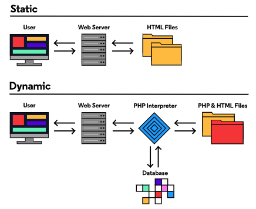
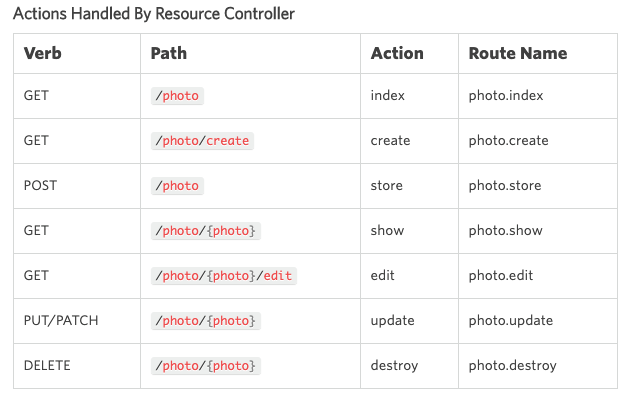

<!-- Laravel Coding Reference.md -->

#  Lexxeous's Laravel Management: 

> For more details about Laravel, see the [open source code hosted on Github](https://github.com/laravel/framework), the [official Laravel homepage](https://laravel.com), or the [Laravel documentation](https://laravel.com/docs/5.8).

> For a nice video tutorial series on Laravel, see this [Learn Laravel from Scratch](https://www.youtube.com/playlist?list=PLriKzYyLb28mtqooR44LgfSxwJb6eJnUi) playlist by **Alessandro Castellani**.

> For an in-depth, detailed example project using PHP, HTML, Laravel, Vue, Markdown for the MVC framework with OOP, see this [Laravel PHP Framework Tutorial](https://www.youtube.com/watch?v=ImtZ5yENzgE) course by **freeCodeCamp.org**.

> For the purposes of this Laravel Management Markdown page, the terms *function* and *method* will be used interchangably.

### What is Laravel?
**Laravel** is a free, open-source, PHP web framework, created by Taylor Otwell and intended for the development of web applications following the Model–View–Controller (MVC) architectural pattern and based on Symfony. Some of the features of **Laravel** are a modular packaging system with a dedicated dependency manager, different ways for accessing relational databases, utilities that aid in application deployment and maintenance, with OOP (Object Oriented Programming).

PHP and Laravel work as an intermediary interpreter for web servers, databses, and HTML renderings, as depicted below: <br>
<div style="text-align:center"></div>

install nvm and npm and composer and node.js

add composers bin folder to PATH

laravel command should give details in terminal

laravel new <proj_name>


### What is Artisan?
Artisan is a _____ that ships with Laravel...

`php artisan` to see a full list of available commands, organized by namespace.

`php artisan -h <namespace>:<command>` will give valuable details about the Artisan command in question.

`php artisan` serve starts the server @ `https://<ip_addr>:<port>` ; http://127.0.0.1:8000 by default

`php artisan make:auth` makes an authention scaffold

npm install installs node.js directories and dependencies for your application

npm run dev compiles the node modules (front end assets) for your application into `/public/css/app.css` and `/public/js/app.js`
If everything compiled successfully you should see something like this:
```bash
 DONE  Compiled successfully in <num>ms

       Asset      Size   Chunks             Chunk Names
/css/app.css   <sz> KiB  /js/app  [emitted]  /js/app
  /js/app.js   <sz> MiB  /js/app  [emitted]  /js/app
```
	– use npm run watch to constantly watch for any front end CSS or JS assests that change, will automatically compile for you
	– The `package.json` file contains many other npm scripts that you can use for your application using `npm run <script_name>`


### Laravel Databases
> A full list of accepted database column datatypes and modifiers is available in the [Laravel Database Documentation](https://laravel.com/docs/5.7/migrations#columns).
> Database table column names should **always** be plural and lowercase.

you cannot register any users until there is a database setup ; create a database file `/database/<db_file_name>.<db_ext>` ; sql or sqlite for example

change DB_CONNECTION (inside the `.env` file) to the `<db_ext>` that you are using and `run php artisan migrate` to initiate the database migration
	– Other useful `php artisan migrate:<command>` options are also available like: `fresh`, `rollback`, and `status`

#### &nbsp;&nbsp;&nbsp;&nbsp;&nbsp;&nbsp; Database Seeders

>> Make sure to run `composer dump-autoload` after every creation of a new database seeder.
This will force Composer to dump and re-index all the project's auto-loading files. *Optionally* you can also run `php artisan migrate:fresh` to wipe your database clean of any prior data, so that the seeder data are the only available entries.

&nbsp;&nbsp;&nbsp;&nbsp;&nbsp;&nbsp;&nbsp;
Create a database seeder with php artisan make:seeder <class_name>TableSeeder. <br>

&nbsp;&nbsp;&nbsp;&nbsp;&nbsp;&nbsp;&nbsp;
Make sure to include `use Illuminate\Support\Facades\DB;`.

&nbsp;&nbsp;&nbsp;&nbsp;&nbsp;&nbsp;&nbsp;
Inside specific database table seeder files, the `run()` function should have somthing like the following:
```php
   // Inside "database/seeds/<class_name>TableSeeder.php"
   DB::table('<table_name>')->insert([ // parent array around data arrays
   ['<key1>' => 'value1', '<key2>' => 'value2'],
   ['<key3>' => 'value3', '<key4>' => 'value4'],
   ...
   ['<key5>' => 'value5', '<keyN>' => 'valueN'],]);
```

&nbsp;&nbsp;&nbsp;&nbsp;&nbsp;&nbsp;&nbsp;
Inside the main table seeder file `DatabaseSeeder.php`, the `run()` function should have something like the following:
```php
   // Inside "database/seeds/DatabaseSeeder.php"
   $this->call(<class_name>TableSeeder::class); // for single table database seeding
   
   
   $this->call([<class_name1>TableSeeder::class, // for multi-table database seeding
              <class_name2>TableSeeder::class,
              ...
              <class_nameN>TableSeeder::class,]);
```

&nbsp;&nbsp;&nbsp;&nbsp;&nbsp;&nbsp;&nbsp;
After your database seeders are appropriately created, run `php artisan db:seed` to seed your database with all your manually entered data. <br>

&nbsp;&nbsp;&nbsp;&nbsp;&nbsp;&nbsp;&nbsp;
If you want to rollback & re-install migrations while simulatneously seeding your database, run `php artisan migrate:refresh --seed`.
 

### PHP Artisan Tinker
`php artisan tinker` allows you to enter your application from the terminal (backdoor) and view any & all data with commands like `User::all();`
	$var->save() will save changes directly for that variable, not for any changes that may have occured with its direct relationships
	$var->push() will save and push changes for that variable and any changes that may have occured for its direct relationships :)

`<class>::truncate();` will delete all of the database instances of `<class>` while inside of a Tinker session


### What is Composer?
`composer require <library>`
	with Laravel package auto-discovery, many times you wont need to reconfigure your application gitto use required packages

`vendor/composer/autoload_classmap.php` if you want to find the vendor file definitions of a specific package like `Illumunate`, `Intervention`, etc...


### What is Blade?
Blade is a template engine inside of Laravel that is used as an extension on PHP views.

Handlbar/mustache syntax (double curly brackets: {{}}) allows the display of data passed to the Blade view or to echo the results of any embedded PHP. Blade `{{ }}` statements are also automatically sent through PHP's `htmlspecialchars` function to prevent XSS attacks.

Blade templates do not require a semicolon for an endline character

@include(/path/to/partial/view) is similar to a layout yield and avoids the use of repeated view code

You can also use:
```php
// Inside external Blade view
@component('<partial/view/path>')
	<dynamic_text>
@endcomponent

// Inside <partial/view/path> Blade view
<html_component class="<html_class>">
	{{$slot}}
</html_component>
```
to render dynamic text across Blade template views (wrapped in the same `<html_class>` styling), without having to repeat the `<html_component>`.


### Laravel Telescope
Telescope is a very powerful Laravel tool that assists with analyzing/monitoring events that occur within your application.

`composer require laravel/telescope` will grab the Telescope package

`php artisan telescope:install` will install the Telescope scaffold into your application

`php artisan migrate` will create the Telescope entries table inside of the database

`<ip_addr>:<port>/telescope` is the URL/GUI for developers to see what is going on during thier application behind the scenes
	you can view, requests, commands, queries, exceptions, logs, Redis server status, among other things to help debug/monitor


### Laravel Routes

Blade and Laravel also give us a very useful function pair that allow for dynamnic routing. Inside any Blade template view, if you type: `{{route('<route_name>')}}` in accordance with a route in `web.php` like:
```php
Route::<action>('<route/path>', function() {
	return view('<view/path>')
})->name('<route_name>');
```
then any change to the route path (which effects the absolute or relative URL) will not break links inside your application, because they are specified by thier `<route_name>` inside the Blade template view.


You can also specify middleware authentication for individual routes by chaining the `middleware()` method onto the and of a route in `web.php` like: `Route::<action>('<route_path>', <controller_name>Controller@<method>)->name('<route_name>')->middleware('auth');`


Below is a snapshot taken directly from the Laravel documentation for the available route verbs, paths, actions, and names: <br>
<div style="text-align:center"></div>


### CSS Styling with Laravel

Use `<link rel="stylesheet" href="{{mix('/path/to/stylesheet')}}>"` (the `href` will most likely be the main stylesheet included with Larvel `/sass/app.scss`) in a Blade view to reference the stylesheet that you want to use for that view

Inside the main stylesheet `/resources/sass/app.scss`, you can also import stylesheet partials for increased abstration and organization using `@import '<partial_name>'` where the stylesheet partial name is `_<partial_name>.scss`.


# GO BACK AND WATCH
<!-- If you want a fast way to develop UI for your application, you can try out Tailwind CSS and easily install it via NPM.

  1. Just run `npm install tailwindcss` and NPM will handle all of the dependencies inside the `node_modules` directory.
  2. Generate an `init` file by running `npx tailwind init` from the root directory of your application. This will create a `tailwind.config.js` file.
  3. Snap `@tailwind` or `@import` directives into your CSS to inject base, components, and/or utilities styles.
    - `@tailwind base` or `import tailwindcss/base`
  4. Follow the Tailwind installation instructions to process your CSS with the CLI tool and manage PostCSS plugins. -->


### Laravel Layouts
If you want to dispay the same view structure without replicating HTML code, then layouts are the perfect tool. Laravel ships with Blade directives that allows direct connections between pairs of views.

```php
// Inside the primary Blade view <primary>.blade.php
@yield('<keyword>') // It is common to use the keyword 'content'

// Inside the secondary Blade view <secondary>.blade.php
@extends('<path/to/primary/view>') // most likely layouts/<view_name>

@section('<keyword>')
	// yielded view components
@endsection
```

### Laravel Models

> Laravel model names should **always** be singular and uppercase.

To create a model run `php artisan make:model <model_name>`.

### Laravel Controllers
By default, Composer comes with a package called `Illuminate` that specifies many different classes. One of these classes comes from `Illuminate\Http\Request` and specifies that every Laravel controller call passes an implicit `Request $request` class-variable pair containing lots of information about the route-controller request. You can use this request to parse data for different views with conditionals or whatever you like. 

All other public functions that are inside `<controller_name>Controller.php`
```php
// Inside "app/Http/Controllers/<controller_name>Controller"
public function __construct()
{
  $this->middleware('auth');
}
```


Another feature that Laravel provides by default is the ability to perform route-model binding. For route-model binding, when passing a variable from a route to a controller that have the same naming convention as a model, you can preprend `\App\<class>` to a function parameter for Laravel to automagically find the model resource that you are referencing (by `$id` or otherwise). It also automagically provides `findOrFail()` functionality for data integrity. UNfortunately, the route-model binding has a property that will produce integers in the *URL* instead of readable names. If you want to override this route-model binding property, modify the model with a function called `getRouteKeyName` and simply return a string that **exactly** matches a desired column in your database.


### Connecting Laravel's MVC Framework

One common way to connect a model, controller, and database column for dynamic filtering of route data is to incorporate a `slug` database column that matches the path name associated with a particular route. With the `$slug` variable already equal to the request path in the controller, compare it with the first result that the model that with the `slug` batabase column, you can forward/return a `compact` version of a specific model instance, to any view (without having to filter with `if` statements), just based on the route call that was passed to the controller. 

```php
// Inside the "web.php" file
Route::get('/{slug}', <controller_name>@<func_name>)

// Inside a controller function
public function <func_name>(Request $request, $slug)
{
	$<model_var> = <model_name>::where('slug', $slug)->first();
	return view('<path/to/view>', compact('<model_var>'));
}
```


#### Laravel Service Providers

`php artisan make:provider <cust_name>ServiceProvider`

list of registered providers in `config/app.php`

By default, Laravel also organizes the services providers into 3 sections:

  * Laravel Framework Service Providers,
  * Package Service Providers, &
  * Custom Application Service Providers
    - These group consists of the exact same providers that exist in `app/Providers/<provider_name>`
    - This is where your custom application service provider will exist.

In the service provider boot method, you could specify what content you want to pass to the view:
```php
// Inside "app/Providers/<cust_name>ServiceProvider"
public function boot()
{
	view()->composer('<view_name>', function($view) { // <view_name> can be a specific view or just '*' to tap all of them
		$<model_vars> = <model>::all();
		return $view->with('<model_vars>', <model_vars>);
	});
}
```

Now in the view, you can accept dynamic databasedata from the database in a looping fashion:
```php
// Inside <view_name>.blade.php
@foreach ($<model_vars> as <model_var>) {
	<html_component> {{ $<model_var>->slug }} </html_component>
	<html_component> {{ $<model_var>-><data> }} </html_component>
	...
}
```

#### Laravel Authentication

Creating a public function called `redirectTo()` will have priority over the default `protected $redirectTo = '<path>'` variable defined in the authentication controllers.

There is a useful quirk that exists for Laravel that could be annoying or maliciously exploited within the context of redirects. The authentication controllers (`LoginController.php`, `RegisterController.php`, `middleware/RedirectIfAuthenticated.php`etc...) maintain a protected redirect variable (or priority taking method) and a reference to `Illuminate\Foundation\Auth\AuthenticatesUsers`. Composer keeps the definitions of these package files in the `vendor` directory. <br>
Inside `vendor/laravel/framework/src/Illuminate/Foundation/Auth/AuthenticatesUsers.php`, there exists a function called `sendLoginResponse()`. When this function returns, it either returns the *unchanged* authenticated request, or the *intended* authenticated request. Since no code exists in the `authenticated()` function that is being called, the ternary operator `?:` always defaults to the *intended* authenticated request. Laravel suggests **never** to change any functionality that exists within any of the `vendor` files, but rather to copy and paste methods that you wish to override into an appropriate controller. In this case, to override the *intended* authenticated request, you should copy:

```php
// Inside "vendor/laravel/framework/src/Illuminate/Foundation/Auth/AuthenticatesUsers.php"
/**
* The user has been authenticated.
*
* @param  \Illuminate\Http\Request  $request
* @param  mixed  $user
* @return mixed
*/
protected function authenticated(Request $request, $user)
{
  //
}
```

and paste it inside `LoginController.php` and modify it as desired.


### Misc.

For support of Laravel 5.7, the `or` Blade operator has been replaced with the PHP-5 default `??` operator for defaulting away from `null` or `false` data.


```php
public function show(\App\<class> <$class_param>)
{
	// code
}
```

`$this->authorize(<policy_func_name>, <other_params>)` inside of a controller (maybe model too?) will call the Policy for `$this` class to authorize the current action being taken before it is blindly executed

# routes take sequential priority and can be conflicting, as a general rule of thumb, place routes that have variables in them towards the bottom of each route group so that they are the last resort, after the static routes

#with many-to-many relationships, create a pivot table migration where the two models in question (to be connected) are in alphabetical order after the create flag separated by an underscore: `--create <classA>_<classB>`


# Laravel comes with an easy to use, out of the box, email system using mailtrap.io. Get an account, open an inbox, copy and paste your username and password into the .env file provided in your Laravel application. You can initiate a new mailable class and associated Markdown view with `php artisan make:mail <MailClassName> -m <md_path_to_view_file>`. The path prepends the `/resources/views/` path by default

# ANY TIME THAT YOU CHANGE THE `.ENV` FILE YOU MUST RESTART THE LARAVEL SERVER USING PHP ARTISAN SERVE FOR THE ENVIRONMENT CHANGES TO TAKE PLACE
# LARAVEL PATHS ARE PREPENDED AT THE /PUBLIC DIRECTORY BY DEFAULT ; THATS THE ONLY PLACE THAT USERS ARE ALLOWED TO ACCESS
# ANY TIME YOU CHANGE FRONT END CONFIGURATIONS (STYLING, FONTS, ETC...) EXECUTE "NPM RUN DEV" TO RECOMPILE ALL OF THE ASSETS FOR THE APPLICATION TO TAKE THE CHANGES BUT YOU DONT HAVETO RESTART THE SERVER
# BECAUSE LARAVEL IS A MVC FRAMEWORK ALL PHP LOGIC AND DATA MANIPULATION SHOULD BE DONE WITH THE CONTROLLERS, VIEWS ONLY PLACE DATA WHERE IT NEEDS TO BE, AND MODELS MODEL A ROW IN THE DATABASE
# dd() (VAR_DUMP AND DIE) is a very powerful function for LARAVEL that can replace PHP's var_dump() ; it displays the info passed to it and returns/kills halting any following sequential statements

# for local database storage you can request('<req_data>')->store('uploads', 'public') this will create a directory "storage/app/public/uploads". But this directory is not accessable from outside the public root project directory (like for viewing via localhost:8000/storage/uploads/<req_data>). If you run php artisan storage:link the "storage/app/public/uploads" directory will be "linked" with the accessable "/public/storage/uploads" directory on the root. The artisan commands need only be run one time during the lifetime of the project for this functionality to stay in effect.

#Laravel has a security feature that automatically passes a 419 Page Expired error upon submitting forms that cannot be verified. The error stems from CSRF and it usually solved by passing an encyption token from the home server to stop malicious users from cURLing invalid form data from outside of the actual form page. @csrf as the next line inside of a HTML form object is all you need to fix this issue.

# @can is another blade directive that will produce true or false that you can wrap HTML in to enable or disable rendering with and will call the policy functions as well as its counterpart `@cannot`

# Laravel comes with a default __construct function that requires user authentication before any other actionable functions can be used. Just put the following at the top of your desired Controller class:
