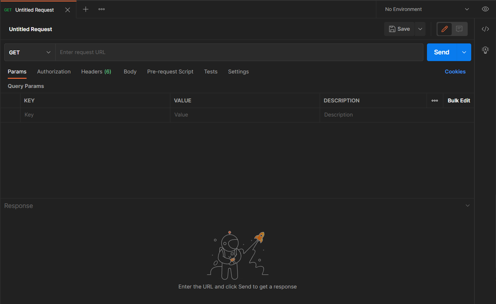
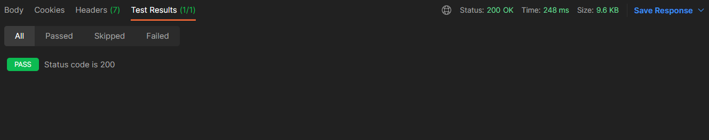
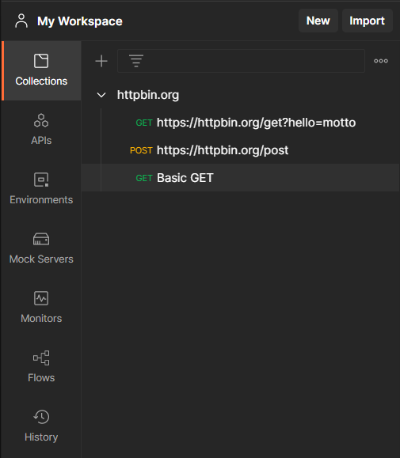
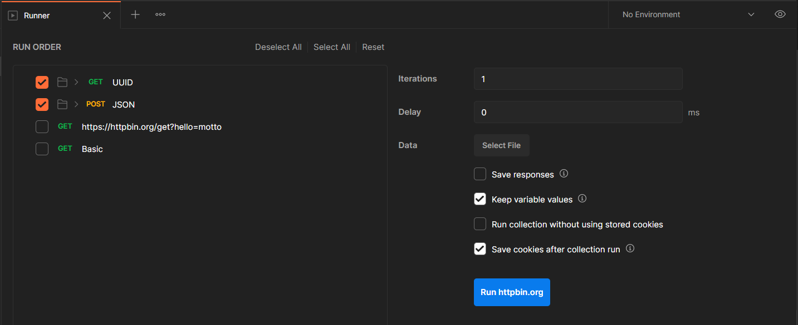
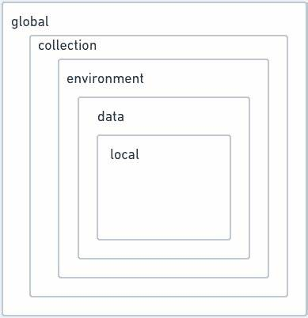
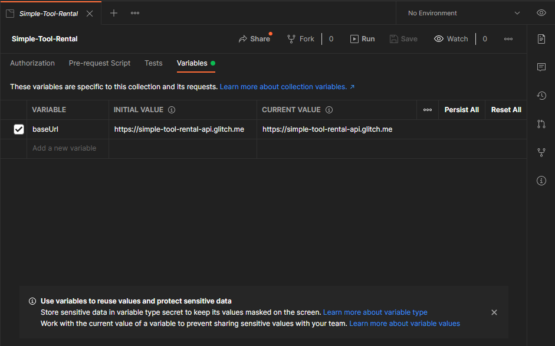
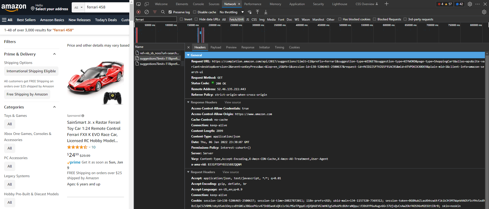

<!-- Postman Management.md -->

#  Lexxeous's Postman Management: 

## I. Summary

**Postman** is a quick and powerful way to test custom and 3rd-party back-end APIs without the need for a front-end interface. As long as the back-end API runs with HTTP RESTful actions, **Postman** is a great pick (however, there are options to run **Postman** requests with legacy API systems).

For more information, please see the [official **Postman** documentation](https://learning.postman.com/docs/getting-started/introduction/).

## II. Installation:

  * [Web Application](https://www.postman.com/) - (*Easiest*)
  * [Standalone Desktop Application](https://www.postman.com/downloads/) - (*Recommended*)
  * [Google Chrome Extension](https://chrome.google.com/webstore/detail/postman-interceptor/aicmkgpgakddgnaphhhpliifpcfhicfo) - (*Deprecated*)

## III. GUI Sections:

### III.i. [Request Builder](https://learning.postman.com/docs/sending-requests/requests/):



> Click on the  button (in the top right corner) to get a quick view of the current environment. This includes things like environment/global/collection variable initial/current values.

> Variables in **Postman** can have global, collection, environment, data, or local-level scope.

> A request should follow the following format: `<request_type> <protocol>://<website_name>/<endpoint>`.

#### III.i.a. Builder Request Types: 

| Request    | Description                                                                                  |
|:----------:|:---------------------------------------------------------------------------------------------|
| GET        | retrieve resource representation/information only; not modify data in any way |
| POST       | create new subordinate resources |
| PUT        | to update an existing resource (if resource doesn't exist, the specific API decides what to do) |
| PATCH      | make a partial update on a resource |
| DELETE     | delete the resources |
| COPY       |  |
| HEAD       |  |
| OPTIONS    |  |
| LINK       |  |
| UNLINK     |  |
| PURGE      |  |
| LOCK       |  |
| UNLOCK     |  |
| PROPFIND   |  |
| VIEW       |  |

#### III.i.b. Request Builder Params:

> Typically prefixed with the `?` character in the URL, assigned with the `=` character, then additional params added with the `&` character. Ex. `https://website.com?param1=1&param2="two`

The variable on the LHS of the equals sign is the *key* and the quantity/string on the RHS of the equals sign is the *value*. These are *key*-*value* pairs that are very similar to JSON and **Python** dictionary notation. You can provide the *key*-*value* pair manually in the request, or you can provide them in the *Query Params* section.

There is a difference between "path parameters" and "query parameters". Path parameters are required in the URL path (the endpoint that is specified with forward slashes `/`.) Query parameters always come after the URL path and the question mark character `?`.

> Optionally, with **Postman** you can include path parameters as "pseudo-variables", dynamically, by prefixing a colon character and the name of the path variable like: `:<path_var_name>`. Then, **Postman** provides an extra section under *Params* to enter custom values for path variables.


#### III.i.c. Request Builder Authorization:

Authentication with the request builder provides you with the following options:

  * Inherit Auth From Parent
  * No Auth
  * API Key
  * Bearer Token
  * Basic Auth
  * Digest Auth
  * OAuth 1.0
  * OAuth 2.0
  * Hawk Authentication
  * AWS Signature
  * NTLM (New Technology LAN Manager) Authentication
  * Akamai EdgeGrid

#### III.i.d. Request Builder Headers:

#### III.i.e. Request Builder Body:

The *body* allows you to send data to a specified endpoint using the following data formatted options:

  * None
  * Form
  * `x-www-form-urlencoded`
  * Raw
  * Binary
  * GraphQL

and allows the data to be interpreted as the following file formats:

  * Text
  * JavaScript
  * JSON
  * HTML
  * XML

> The *body* section has a "Beautify" button that will lint your inputted data for you.

> Global variables can be referenced in the *body* with string interpolation, using the `""` syntax.

#### III.i.f. Request Builder Pre-request Script:

These scripts will run prior to a request actually being sent/executed. However, you cannot write tests/assertions because there is no response to act upon.

An example of some useful pre-request script actions could be:

  * calculating current timestamps
  * generating some random data
  * save data to variable(s) for use in the post-request test(s)
  * setup output logging

#### III.i.g. Request Builder Tests:

*Tests* allow us to run code/scripts to interact with the data that we get from **Postman** requests. Think of this as an alternative to having an interactive front-end already developed for your application. Instead, we can write **Postman** (`pm`) scripts (with **JavaScript**) to do things like:

  * Get/Set Global/Environment variables
  * Check for the value of status code(s)
  * Interpret the value of a JSON string
  * Inspect HTTP headers
  * etc...

> One of the best ways to get started with **Postman** *tests* is to use the provided snippets. The snippets will automatically inject the relevant code for the task you wish to run in the script. Otherwise, you can learn more about writing **Postman** *tests* with [the "Writing tests" documentation](https://learning.postman.com/docs/writing-scripts/test-scripts/).

A single request can have multiple *tests* and they run after the request is completed. Most *tests* are assertion based, asserting that a value or statement is true, false, exists, or doesn't exist. If any of the assertions fail after a request is made, the entire *test* fails.

> Make sure that you write *tests*/assertions that CAN fail.

The code below is an example of a simple **Postman** assertion/*test* that checks the value of the status code for a request's response. This test checks for a status code of `200`. The **Postman** `test()` function, in this case, takes a string and a call-back function as its input arguments.

```js
pm.test("Status code is 200", function () {
    pm.response.to.have.status(200);
});
```


#### III.i.h. Request Builder Settings:

#### III.i.j. Request Builder Response:



##### III.i.j.1. Request Builder Response Body:

##### III.i.j.2. Request Builder Response Cookies:

##### III.i.j.3. Request Builder Response Headers:

##### III.i.j.4. Request Builder Response Test Results:

When you write *Tests* with the *Request Builder*, if those tests make assertions or attempt to validate the existance or value of something, then the results of those *Tests* will be displayed in this section.

### III.ii Collections:

*Collections* allow you to store groups of requests that are useful for a particular project, website, etc. This allows greater for greater granularity on organization for projects. *Collections* and their requests can be documented, forked, commented on, watched, organized into folders, & can provide relevant code snippets.



> You can also provide custom names to requests and have multiple requests of the same "type" in the same collection.

The *Collections Runner* allows you to run all of the requests in a given collection. You can determine which requests to run, modify their order, specify an amount of iterations, choose optional delay (in milliseconds), among other useful options.



#### III.ii.a Authorization:

*Collections* in **Postman** provide all of the same authentication options except for "Inherit Auth From Parent", because *collections* have no parent to inherit from. When setting the authentication method for the *collection*, all child requests that are set to inherit the authentication method from the parent will use the method defined for the *collection*. Otherwise, you can set a different authentication method for each individual request, if desired.

#### III.ii.b Pre-request Script:

*Scripts* defined at the collection level will run before every request in said collection.

#### III.ii.c Tests:

*Tests* defined at the collection level will run before every request in said collection.

#### III.ii.d Variables:

*Variables* defined at the collection level (within the collection's scope) are available only to said collection and can be referenced in a request using the `{{<var}}` interpolation syntax.

The following diagram represents the scope of variables in **Postman**. By default, the variable values will be overwritten by its most narrow scope. For example, if a variable exists in a collection-level scope but also exists in the local-level scope, the local-level scope will take precedence.



**Variable scope pros and cons**:

  * Global (`pm.globals`):
    - Good for quick prototyping
    - Can be accessed from anywhere
    - Creates messy/sloppy code
    - Should be avoided and not used in permanent solutions

  * Collection (`pm.collectionVariables`):
    - Tied to a specific collection for values that should not change
    - Can be updated with a script
    - Useful for specific group(s) of API calls, not for whole environment testing
    - Can eliminate duplicate environment variable data

  * Environment (`pm.environment`):
    - Ideal for working with different servers and isolated services
    - Tied to the currently selected **Postman** environment
    - Can pass data to other requests
    - Use for URLs, authentication, etc...

  * Data (???):
    - Used when working with multiple datasets
    - Exist only during the execution of an iteration
    - Can only be set from a CSV or JSON file

  * Local (`pm.variables`):
    - Can pass data within a specific request, within a collection, or between Collection Runner and Newman iterations
    - Only created with scripts, no GUI manipulation offered
    - Local variable no longer exists after its request script has been executed
    - Will override all other scopes

> For more information about **Postman** variables and variable scope, see [Demystifying Postman Variables: HOW and WHEN to use Different Variable Scopes](https://medium.com/apis-with-valentine/demystifying-postman-variables-how-and-when-to-use-different-variable-scopes-66ad8dc11200).



### III.iii APIs:

### III.iv Environments:

### III.v Mock Servers:

### III.vi Monitors:

### III.vii Flows:

### III.viii History:

## IV. Misc:

### IV.i. Endpoints:

Endpoints represent different addresses/paths/locations/pages available on the website for the API. Endpoints are typically denoted with a different webpage suffix: `/<path>/[to]/[endpoint]`.

### IV.ii. Variables:

> You can highlight a subset of the request text to initiate a variable helper popup window.
> You can hover over an interpolated variable in the request builder to view its data.

#### IV.ii.a Initial vs. Current Value:

**Current Value**:

  * **Postman** uses this value by default when sending requests.
  * This values is never synced with **Postman** servers.
  * If blank/untouched, this value assumes the initial value.
  * This value will not be shared with collaborators.
  * Use this value to store sensitive data that will not be synced or shared.

**Initial Value**:

  * This value is shared with teams and other collaborating individuals when you share a collection, request, etc...
  * This value is synced with **Postman** servers.
  * Use the initial value to store general/default/template data.

### IV.iii. Importing Complex Requests from a Web Browser:

Anytime you do something on a webpage, there is probably at least one HTTP request being served in the background. If you want to capture the HTTP request of a specific action:

  * Inspect your current page
  * Go to the "Network" tab
  * Check the "Preserve log" box (optional)
  * Use the filers and options available to find the request you want
  * Right click on the request and copy as `cURL (Bash)`
  * *Import* the `cURL (Bash)` request as "Raw Text" into **Postman**

