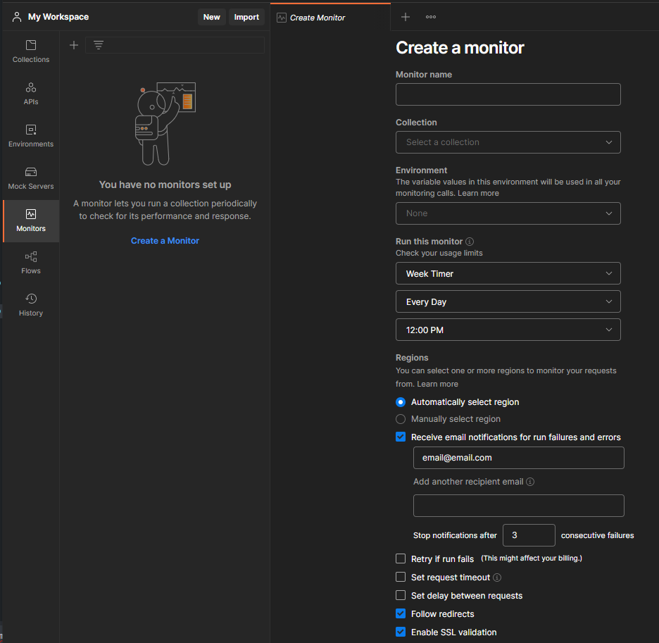
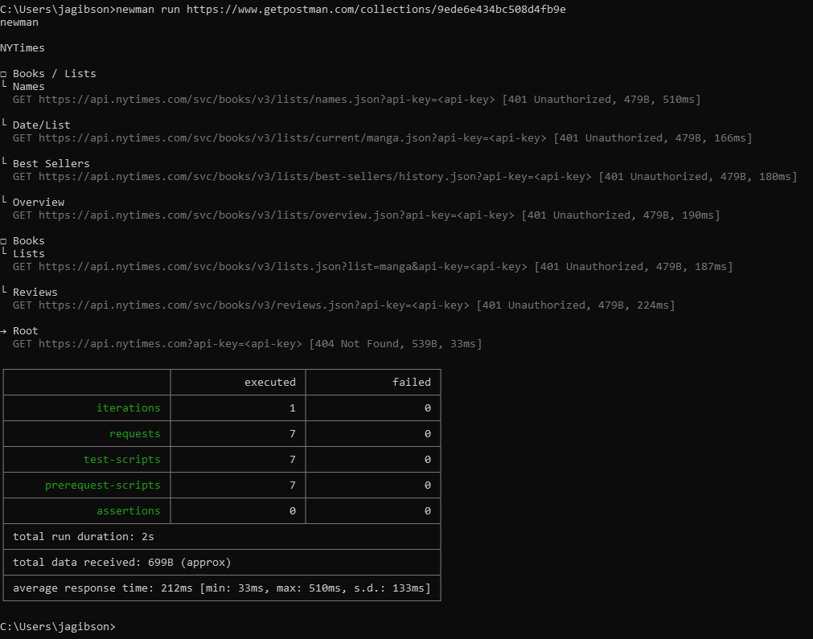

<!-- Postman Management.md -->

#  Lexxeous's Postman Management: 

## I. Summary

**Postman** is a quick and powerful way to test custom and 3rd-party back-end APIs without the need for a front-end interface. As long as the back-end API runs with HTTP RESTful actions, **Postman** is a great pick (however, there are options to run **Postman** requests with legacy API systems).

For more information, please see the [official **Postman** documentation](https://learning.postman.com/docs/getting-started/introduction/).

## II. Installation:

  * [Web Application](https://www.postman.com/) - (*Easiest*)
  * [Standalone Desktop Application](https://www.postman.com/downloads/) - (*Recommended*)
  * [Google Chrome Extension](https://chrome.google.com/webstore/detail/postman-interceptor/aicmkgpgakddgnaphhhpliifpcfhicfo) - (*Deprecated*)

## III. GUI Sections:

### III.i. [Request Builder](https://learning.postman.com/docs/sending-requests/requests/):


> Click on the  button (in the top right corner) to get a quick view of the current environment. This includes things like environment/global/collection variable initial/current values.

> Variables in **Postman** can have global, collection, environment, data, or local-level scope.

> A request should follow the following format: `<request_type> <protocol>://<website_name>/<endpoint>`.

#### III.i.a. Builder Request Types: 

| Request    | Description                                                                                  |
|:----------:|:---------------------------------------------------------------------------------------------|
| GET        | retrieve resource representation/information only; not modify data in any way |
| POST       | create new subordinate resources |
| PUT        | to update an existing resource (if resource doesn't exist, the specific API decides what to do) |
| PATCH      | make a partial update on a resource |
| DELETE     | delete the resources |
| COPY       |  |
| HEAD       |  |
| OPTIONS    |  |
| LINK       |  |
| UNLINK     |  |
| PURGE      |  |
| LOCK       |  |
| UNLOCK     |  |
| PROPFIND   |  |
| VIEW       |  |

#### III.i.b. Request Builder Params:

> Typically prefixed with the `?` character in the URL, assigned with the `=` character, then additional params added with the `&` character. Ex. `https://website.com?param1=1&param2="two`

The variable on the LHS of the equals sign is the *key* and the quantity/string on the RHS of the equals sign is the *value*. These are *key*-*value* pairs that are very similar to JSON and **Python** dictionary notation. You can provide the *key*-*value* pair manually in the request, or you can provide them in the *Query Params* section.

There is a difference between "path parameters" and "query parameters". Path parameters are required in the URL path (the endpoint that is specified with forward slashes `/`.) Query parameters always come after the URL path and the question mark character `?`.

> Optionally, with **Postman** you can include path parameters as "pseudo-variables", dynamically, by prefixing a colon character and the name of the path variable like: `:<path_var_name>:`. Then, **Postman** provides an extra section under *Params* to enter custom values for path variables.


#### III.i.c. Request Builder Authorization:

Authentication with the request builder provides you with the following options:

  * Inherit Auth From Parent
  * No Auth
  * API Key
  * Bearer Token
  * Basic Auth
  * Digest Auth
  * OAuth 1.0
  * OAuth 2.0
  * Hawk Authentication
  * AWS Signature
  * NTLM (New Technology LAN Manager) Authentication
  * Akamai EdgeGrid

#### III.i.d. Request Builder Headers:

#### III.i.e. Request Builder Body:

The *body* allows you to send data to a specified endpoint using the following data formatted options:

  * None
  * Form
  * `x-www-form-urlencoded`
  * Raw
  * Binary
  * GraphQL

and allows the data to be interpreted as the following file formats:

  * Text
  * JavaScript
  * JSON
  * HTML
  * XML

> The *body* section has a "Beautify" button that will lint your inputted data for you.

> Global variables can be referenced in the *body* with string interpolation, using the `""` syntax.

#### III.i.f. Request Builder Pre-request Script:

These scripts will run prior to a request actually being sent/executed. However, you cannot write tests/assertions because there is no response to act upon.

An example of some useful pre-request script actions could be:

  * calculating current timestamps
  * generating some random data
  * save data to variable(s) for use in the post-request test(s)
  * setup output logging

#### III.i.g. Request Builder Tests:

*Tests* allow us to run code/scripts to interact with the data that we get from **Postman** requests. Think of this as an alternative to having an interactive front-end already developed for your application. Instead, we can write **Postman** (`pm`) scripts (with **JavaScript**) to do things like:

  * Get/Set Global/Environment variables
  * Check for the value of status code(s)
  * Interpret the value of a JSON string
  * Inspect HTTP headers
  * etc...

> One of the best ways to get started with **Postman** *tests* is to use the provided snippets. The snippets will automatically inject the relevant code for the task you wish to run in the script. Otherwise, you can learn more about writing **Postman** *tests* with [the "Writing tests" documentation](https://learning.postman.com/docs/writing-scripts/test-scripts/).

A single request can have multiple *tests* and they run after the request is completed. Most *tests* are assertion based, asserting that a value or statement is true, false, exists, or doesn't exist. If any of the assertions fail after a request is made, the entire *test* fails.

> Make sure that you write *tests*/assertions that CAN fail.

The code below is an example of a simple **Postman** assertion/*test* that checks the value of the status code for a request's response. This test checks for a status code of `200`. The **Postman** `test()` function, in this case, takes a string and a call-back function as its input arguments.

```js
pm.test("Status code is 200", function () {
    pm.response.to.have.status(200);
});
```

> ! ! !
> IMPORTANT NOTE: Using `.equal()` and `.eql()` do not provide the same functionality. The former function checks that object `<A>` is the exact same object as object `<B>`. This is not typically useful as it is more common to check the values of the properties contained within objects. The latter function exhibits such behavior.
> ! ! !

**Using the Chai Assertion Library for Tests**:

**[Chai](https://www.chaijs.com/api)** is a behavior-driven assertion library that is built into **Postman** that is able to create very human-readable assertion chains.


#### III.i.h. Request Builder Settings:

#### III.i.j. Request Builder Response:


##### III.i.j.1. Request Builder Response Body:

HTTP REST API responses can come in a variety of formats.

  * JSON - `pm.response.json()` (most common)
  * XML - `xml2Json(pm.response)`
  * HTML - `cheerio(pm.response.text())` ([Cheerio](https://github.com/cheeriojs/cheerio) is a built-in library for **Postman**)
  * Plain-Text - `pm.response.text()`
  * CSV - `csv-parse/lib/sync`

##### III.i.j.2. Request Builder Response Cookies:

`pm.response.cookies`

##### III.i.j.3. Request Builder Response Headers:

`pm.response.headers`

##### III.i.j.4. Request Builder Response Test Results:

When you write *Tests* with the *Request Builder*, if those tests make assertions or attempt to validate the existance or value of something, then the results of those *Tests* will be displayed in this section.

### III.ii Collections:

*Collections* allow you to store groups of requests that are useful for a particular project, website, etc. This allows greater for greater granularity on organization for projects. *Collections* and their requests can be documented, forked, commented on, watched, organized into folders, & can provide relevant code snippets.


> You can also provide custom names to requests and have multiple requests of the same "type" in the same collection.

The *Collections Runner* allows you to run all of the requests in a given collection. You can determine which requests to run, modify their order, specify an amount of iterations, choose optional delay (in milliseconds), among other useful options.


> You can share a collection in a variety of ways: inviting collaborators via email, making your collection public and allowing forks, and sending current state URL links to JSON data. Keep in mind that URL links to JSON data are only valid for a single state of the collection. An updated link is required if an update was made to the collection.

#### III.ii.a Authorization:

*Collections* in **Postman** provide all of the same authentication options except for "Inherit Auth From Parent", because *collections* have no parent to inherit from. When setting the authentication method for the *collection*, all child requests that are set to inherit the authentication method from the parent will use the method defined for the *collection*. Otherwise, you can set a different authentication method for each individual request, if desired.

#### III.ii.b Pre-request Script:

*Scripts* defined at the collection level will run before every request in said collection.

#### III.ii.c Tests:

*Tests* defined at the collection level will run before every request in said collection.

#### III.ii.d Variables:

*Variables* defined at the collection level (within the collection's scope) are available only to said collection and can be referenced in a request using the `{{<var}}` interpolation syntax.

The following diagram represents the scope of variables in **Postman**. By default, the variable values will be overwritten by its most narrow scope. For example, if a variable exists in a collection-level scope but also exists in the local-level scope, the local-level scope will take precedence.


**Variable scope pros and cons**:

  * Global (`pm.globals`):
    - Good for quick prototyping
    - Can be accessed from anywhere
    - Creates messy/sloppy code
    - Should be avoided and not used in permanent solutions

  * Collection (`pm.collectionVariables`):
    - Tied to a specific collection for values that should not change
    - Can be updated with a script
    - Useful for specific group(s) of API calls, not for whole environment testing
    - Can eliminate duplicate environment variable data

  * Environment (`pm.environment`):
    - Ideal for working with different servers and isolated services
    - Tied to the currently selected **Postman** environment
    - Can pass data to other requests
    - Use for URLs, authentication, etc...

  * Data (???):
    - Used when working with multiple datasets
    - Exist only during the execution of an iteration
    - Can only be set from a CSV or JSON file

  * Local (`pm.variables`):
    - Can pass data within a specific request, within a collection, or between Collection Runner and Newman iterations
    - Only created with scripts, no GUI manipulation offered
    - Local variable no longer exists after its request script has been executed
    - Will override all other scopes

> For more information about **Postman** variables and variable scope, see [Demystifying Postman Variables: HOW and WHEN to use Different Variable Scopes](https://medium.com/apis-with-valentine/demystifying-postman-variables-how-and-when-to-use-different-variable-scopes-66ad8dc11200).


### III.iii APIs:

### III.iv Environments:

Environments in **Postman** are very similar to system-level and user-level environments for standard operating systems. You should use environments and environment variables when you intend to separate information that is specific to a particular collection or service under test. For example, if you needed to test 2 or more mutually exclusive APIs, but both required an API key, for authentication, you could use environments to specify the same variable, `api-key`, but simply switch environments between said isolated API tests.

> As a forewarning, environment (and global) variables do not persist, during runtime, when using test automation tools like Monitors, **Newman**, and **Jenkins**. You will have to use an alternate method to specify necessary parameters. This can be in the form of collection variables with *Initial Value*s, command line flags/arguments, or setting the desired variables on the server that will be running the automated tests.

### III.v Mock Servers:

### III.vi Monitors:

Monitors in **Postman** are primarily offered to *Pro* user accounts, but are also available in limited amounts to free accounts (1000 API calls per month).

Monitors allow you to run a set of tests at regular time intervals.



Known limitations to **Postman** monitors are:
  * The servers running the tests are not on the same network as you.
  * Monitors cannot import currently existing global variables, only currently existing environment variables.
  * Global & environment variables are not persisted through sequential tests during runtime.
    - May be best to use collection variables instead.

### III.vii Flows:

### III.viii History:

## IV. Misc:

### IV.i. Endpoints:

Endpoints represent different addresses/paths/locations/pages available on the website for the API. Endpoints are typically denoted with a different webpage suffix: `/<path>/[to]/[endpoint]`.

### IV.ii. Variables:

> You can highlight a subset of the request text to initiate a variable helper popup window.
> You can hover over an interpolated variable in the request builder to view its data.

#### IV.ii.a Initial vs. Current Value:

**Current Value**:

  * **Postman** uses this value by default when sending requests.
  * This values is never synced with **Postman** servers.
  * If blank/untouched, this value assumes the initial value.
  * This value will not be shared with collaborators.
  * Use this value to store sensitive data that will not be synced or shared.

**Initial Value**:

  * This value is shared with teams and other collaborating individuals when you share a collection, request, etc...
  * This value is synced with **Postman** servers.
  * Use the initial value to store general/default/template data.

### IV.iii. Importing Complex Requests from a Web Browser:

Anytime you do something on a webpage, there is probably at least one HTTP request being served in the background. If you want to capture the HTTP request of a specific action:

  * Inspect your current page
  * Go to the "Network" tab
  * Check the "Preserve log" box (optional)
  * Use the filers and options available to find the request you want
  * Right click on the request and copy as `cURL (Bash)`
  * *Import* the `cURL (Bash)` request as "Raw Text" into **Postman**


### IV.iv. Test Automation Tools:

Using automation can reduce repetitive manual work, allows instant feedback when something does not work anymore, and enables identification of software bugs early in the development process.

  1. Collection Runner

See the [**Collections** section](https://github.com/Lexxeous/technical_references/blob/master/Postman/Postman%20Management.md#iiiii-collections) for more information about the Collection Runner that is built into **Postman**.

  2. Postman Monitors (w/ *Pro* account)

See the [**Monitors** section](https://github.com/Lexxeous/technical_references/blob/master/Postman/Postman%20Management.md#iiivi-monitors) for more information about the Monitors that are built into **Postman**.

  3. **Newman**

**Newman** is a CLI tool that allows a user to run **Postman** collections directly from the command line. It is installed as a global command line tool using NodeJS and NPM by running the following command: `npm install -g newman`. Validate the installation of **Newman** by running `newman --version`. Then, you can execute a **Postman** collection by running `newman run <url_link_to_collection>`.

> If you encounter an error that **Newman** is "*unable to get local issuer certificate*", you can either run the collection with the `--insecure` flag, or add an environment variable for NodeJS called `NODE_EXTRA_CA_CERTS` and set it equal to a path to any `.cer` file.



An alternative way to run a collection using **Newman** is with its UID and a **Postman** API key. The [**Newman** documentation](https://github.com/postmanlabs/newman#readme) has a section on [Using **Newman** with the Postman API](https://github.com/postmanlabs/newman#using-newman-with-the-postman-api).

  * First, generate an API key, `<api-key>`, from [your personal account API key settings page](https://web.postman.co/settings/me/api-keys).
  * Next, use a GET request in **Postman** to retrieve a list of your collections using `https://api.getpostman.com/collections?apikey=<api_key>`.
  * Then, locate the desired collection UID, `<coll_uid>`.
  * Next, use a separate GET request in **Postman** to retrieve a list of your environments using `https://api.getpostman.com/environments?apikey=<api_key>` (optional).
  * Similarly, locate the desired environment UID, `env_uid` (optional).
  * Finally, you can run **Newman** with an unchanging collection URL link by combining the aforementioned information as follows:

```sh
# Note the use of different UIDs for the desired collection and the desired environment.

$ newman run "https://api.getpostman.com/collections/<coll_uid>?apikey=<api_key>" \ # specify collection & API key
    --environment "https://api.getpostman.com/environments/<env_uid>?apikey=<api_key>" \ # specify env (optional)
```

This method provides a way to run **Postman** collections with **Newman** without ever having to re-export or regenerate URL links or JSON files. The changes to a **Postman** collection are automatically synced to your personal profile, then the **Postman** API always retrieves the current state information.

> ! ! !
> IMPORTANT NOTE: Variables will only persist for **Newman** calls if their "*Initial Value*" is set. The "*Current Value*" is for locally stored variables on your host machine. 
> ! ! !

**Newman Reporters**

```sh
# You can use reporting flags to format your Newman output: 

    --reporters [cli|json|junit|progress|emojitrain|html|htmlextra|...] \ # choose <reporter_name> (optional)
    --reporter-<reporter_name>-export "newman/<filename>.[txt|xml|json|...]" # export results to file (optional)

# You can specify an absolute path for file export, otherwise, the report will be placed
# in your current directory.
```

According to the [**Newman** "Configuring Reporters" documentation](https://www.npmjs.com/package/newman-reporter-html),

the default **Newman** reporters are

  * cli - Outputs to the CLI
  * json - Outputs a JSON file.
  * junit - Outputs an XML file.
  * progress - Prints a standard ASCII progress bar on the command line.
  * emojitrain - Prints an emoji-based progress bar on the command line.

and more **Newman** reporters are available for install as well by running `npm install -g newman-reporter-<reporter_name>` while `<reporter_name>` is:

  * [html](https://www.npmjs.com/package/newman-reporter-html) - Also allows customization of the [default report template](https://github.com/postmanlabs/newman-reporter-html/blob/develop/lib/template-default.hbs) with additional [reporter CLI options](https://www.npmjs.com/package/newman-reporter-html#options).
  * [htmlextra](https://www.npmjs.com/package/newman-reporter-htmlextra)
  * [csv](https://github.com/matt-ball/newman-reporter-csv)
  * etc...

> Use `newman --help` and `newman run --help` for more information.

  4. **Newman** + **Jenkins**
  5. **Newman** + other CI services

> **Newman** is a command line tool made by the same developers who created **Postman**. It is offered as a companion product. **Newman** can run tests independently from **Postman** and is ideal for running tests on a CI server like **Jenkins**.

### IV.v. Converting Postman Collections:

The current version of **Postman** no longer supports the import or use of version 1 (v1) collections. If you wish to use old **Postman** collections, you will have to convert them to version 2 (v2). Fortunately, there is a **Postman** collection version conversion tool available with NPM.

> For more information regarding the conversion tool, see the [Converting Postman Collections from v1 to v2 documentation](https://learning.postman.com/docs/getting-started/importing-and-exporting-data/#converting-postman-collections-from-v1-to-v2).

Install the conversion tool globally with NPM by running:

```sh
npm install -g postman-collection-transformer
```

Validate the package installation using:

```sh
postman-collection-transformer [-V|--version]
```

Get more help and information about the conversion tool by running:

```sh
postman-collection-transformer convert [-h|--help]
```

Then, convert the desired v1 file into a v2 file using:

```sh
postman-collection-transformer convert -i <path/to/input/v1/file>.json \ # input file
                                       -o <path/to/output/v2/file>.json \ # output file
                                       -j 1.0.0 \ # input version
                                       -p 2.0.0 \ # output version
                                       -P # pretty print output (optional)
```