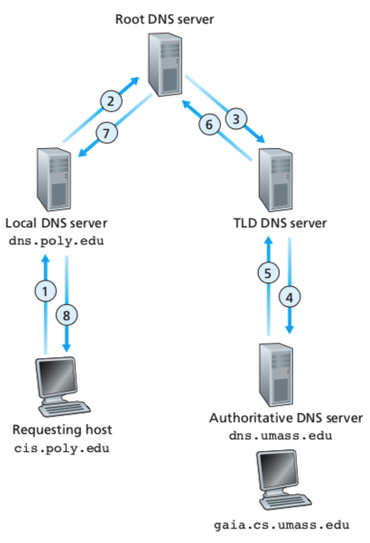
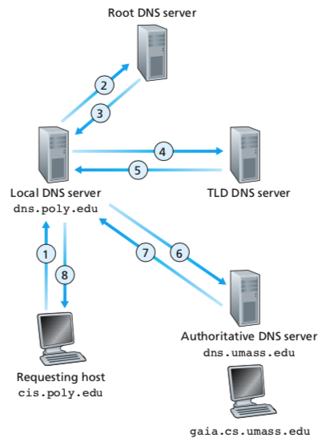
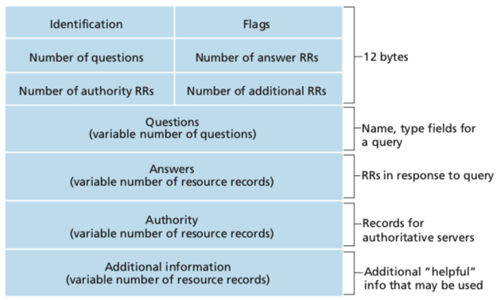

<!-- DNS Management -->

#  Lexxeous's DNS Management: 
### Manage DNS Server Infastructure.

##### General DNS Information.

DNS stands for "Domain Naming System". 

##### DNS Hierarchy.

##### Recursive Queries.

##### Iterative Queries.

##### DNS Message Format.
