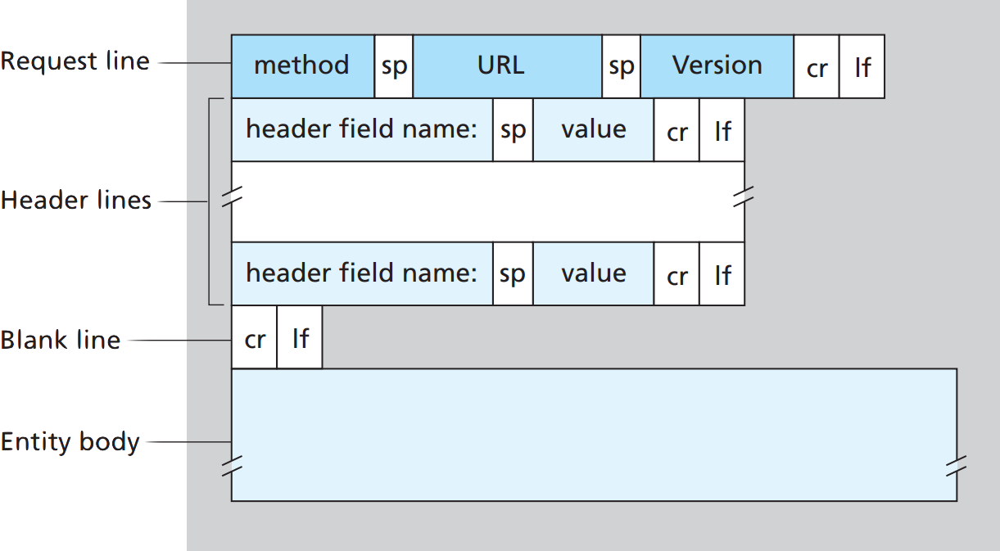
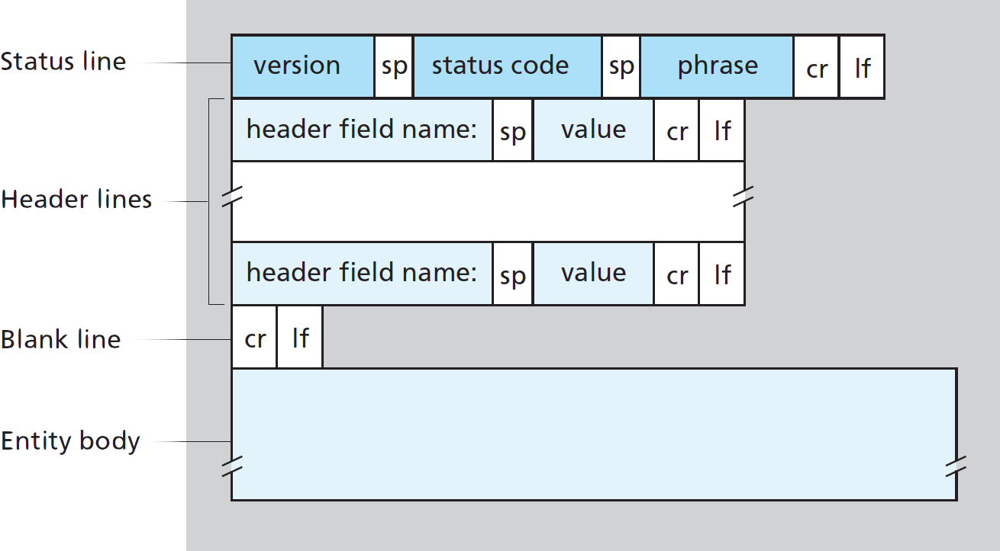
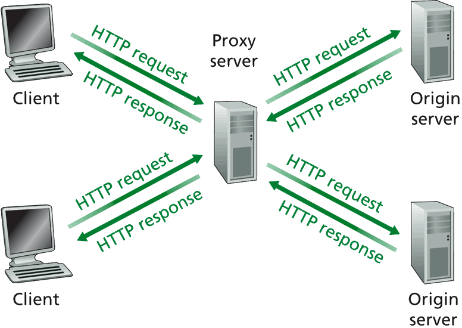
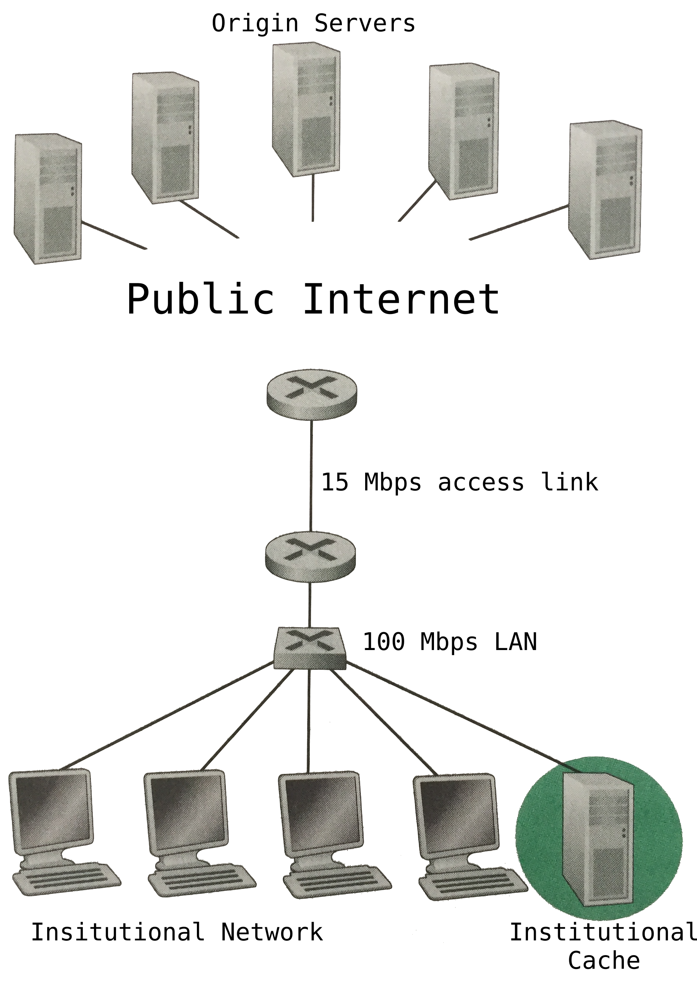

<!-- HTTP Management -->

#  Lexxeous's HTTP Management: 
### Manage HTTP & HTTPS Pages.

#### General HTTP Information.

HTTP stands for "Hyper-Text Transfer Protocol".<br>
It's how browsers & web servers communicate; it's important to understand if you want to write any kind of web application.<br>
HTTP is a stateless protocol (the server retains no information about the client). Every request is different from the last, that's why we need to use Cookies for user sessions.<br>
By default, HTTP uses persistent connections, but clients and/or server can be configured to us non-persistent connections instead.<br>
HTTP is primarily a `pull` protocol.<br>
Version **1.1** (the most common) is text-based. This means that you can understand it without any special tools.<br>
Version **2.0** is binary based. Binary protocols require special tools to work with but they are more efficient.<br>

<br>
<!--------------------------------------------------------------------------------------------------------------------------------------->

#### HTTP Request Messages.

HTTP request messsages consist of a request line, header lines, a blank line, and the entity (message) body. Files and data being downloaded, via the HTTP request, are contained in the entity body.<br>


```
# Example request message.
METHOD /somedir/page.html HTTP/version_num
Header: value
Host: www.someurl.com
Connection: close
User-agent: Mozilla/5.0
Accept-language: fr
If-modified-since: Wed, 9 Sep 2015 09:23:34 GMT # conditional header
Cookie: 1678

(request message data ...)
```
> A full list of HTTP `request methods` can be found [here](https://en.wikipedia.org/wiki/Hypertext_Transfer_Protocol#Request_methods).

<br>
<!--------------------------------------------------------------------------------------------------------------------------------------->

#### HTTP Response Messages.

HTTP response messsages consist of a status line, header lines, a blank line, and the entity (message) body. Files and data being uploaded, via the HTTP response, are contained in the entity body.<br>


```
# Example response message.
HTTP/version_num status_code_value status_code_title
Header: value
Connection: close
Date: Sun, 09 Sep 2018 15:12:46 GMT
Server: Apache/2.2.3 (CentOS)
Last-Modified: Sun, 9 Sep 2018 14:06:35 GMT
Content-Length: 6821
Content-Type: text/html
Set-cookie: 1678

(response message data ...)
```

> A full list of HTTP `header options` can be found [here](https://en.wikipedia.org/wiki/List_of_HTTP_header_fields).

<br>
<!--------------------------------------------------------------------------------------------------------------------------------------->

#### HTTP Status Codes.

| Value      | Title                      | Description                                                                                  |
|:----------:|:--------------------------:|:---------------------------------------------------------------------------------------------|
| 200        | OK                         | Request succeeded and the information is returned in the response.                           |
| 301        | Moved Permanently          | New URL is specified in `Location:` header. Client software automatically retrieves new URL. |
| 400        | Bad Request                | Generic error code indicating that the request could not be understood by the server.        |
| 404        | Not Found                  | The requested document/file/page does not exist on the server.                               |
| 500        | HTTP Version Not Supported | The requested HTTP protocol version is not supported by the server.                          |

> A full list of HTTP `status codes` can be found [here](https://en.wikipedia.org/wiki/List_of_HTTP_status_codes).

<br>
<!--------------------------------------------------------------------------------------------------------------------------------------->

#### Web Caching.

Web caches (proxy servers) are network entities that satisfy HTTP requests on behalf of an origin web server. The proxy has its own disk storage and keeps copies of recently and commonly requested objects in this storage (similar to CPU cache), ready for use to clients. The proxy acts as a sever and a client at the same time.
<br>

Adding a proxy server to a network (like an institutional network such as this) can decrease and/or eliminate the effects of bottlenecking within the network core. Otherwise, the institutional network would automatically be subject to the speed of the 15Mbps access link and not take full advantage of thier 100Mbps router.


<br>
<!--------------------------------------------------------------------------------------------------------------------------------------->


#### Peer-to-Peer (P2P) File Distribution and Communication.

While many applications used are controlled/managed by a server-client infastructure (with significant reliance on "always-on" servers), there also exists a collection of intermittently connected hosts, called peers, that communicate directly with eachother. These peers are typically not owned by any company, institution, or ISP, but instead are desktops & laptops controlled by genernal users.

<!--------------------------------------------------------------------------------------------------------------------------------------->


### Use HTTP Requests with RoR.

#### Doing something specific.

```sh
# Comment
Code
```

<br>
<!--------------------------------------------------------------------------------------------------------------------------------------->

#### Useful HTTP Related RoR Gems.

* [faraday](https://github.com/lostisland/faraday)
* [httparty](https://github.com/jnunemaker/httparty)
* [rest-client](https://github.com/rest-client/rest-client)
* [typhoeus](https://github.com/typhoeus/typhoeus)


For more information regarding HTTP with RoR, visit the site(s):

* [The Ultimate Guide to HTTP Requests in Ruby by Jesus Castello](https://www.rubyguides.com/2018/08/ruby-http-request/?tl_inbound=1&tl_target_all=1&tl_form_type=1&tl_period_type=3)
