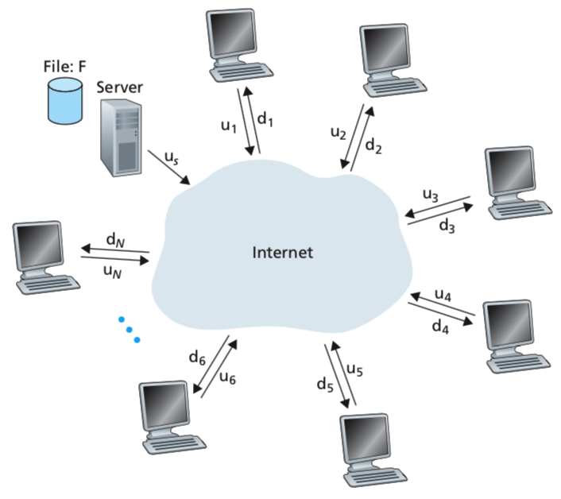

<!-- P2P Management.md -->

#  Lexxeous's P2P Management: 
### Manage P2P Servers & Clients.

#### General P2P Information.

P2P stands for "Peer-to-Peer" Architecture. 
 
Most other protocols and applications (HTTP, SMTP DNS, etc...) have reliance on "always-on" server-client architecture. With P2P architecture, there is little (or no) reliance on "always-on" infastructure. Instead, pairs of intermittently connected hosts (peers) communicate directly with eachother. These peers are not owned by organizations or companies or ISPs, but are desktops and laptops owned by users.

#### P2P File Distribution Structure.

In P2P file distribution, each and any peer can redistribute and portion of a file that it has received (and kept and seeded) to any other peers that request the same file (or portions of the file).

#### BitTorrent.

BitTorrent is a very common P2P file distribution protocol.

#### µTorrent.

µTorrent is a very common P2P file distribution client/application. Just as there are many web clients/applications conforming to the HTTP protocol, there are also many P2P file distribution clients/applications that conform to the BitTorrent Protocol (of which µTorrent is one).