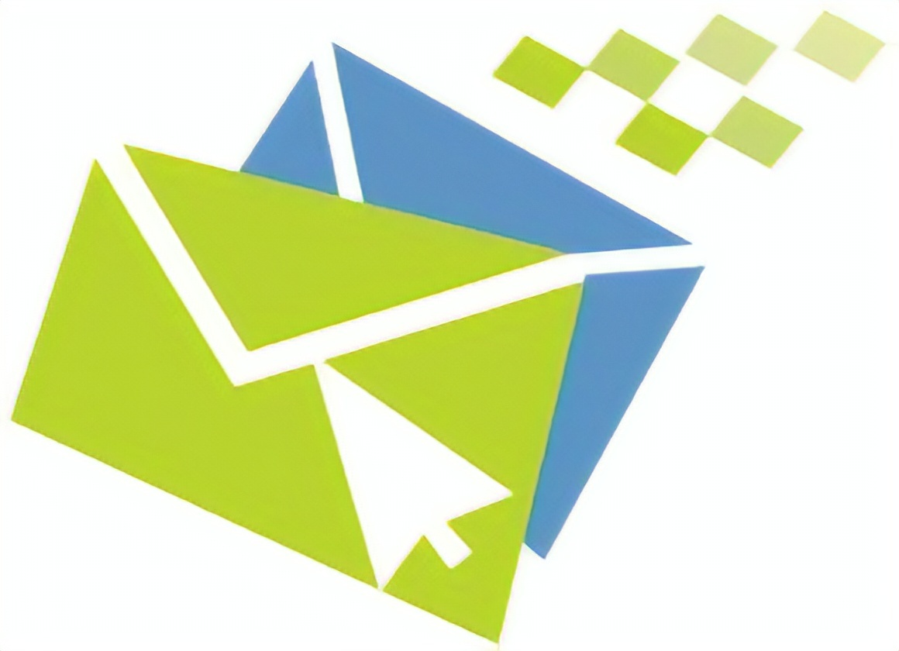

<!-- SMTP Management -->

#  Lexxeous's SMTP Management: 
### Manage Electronic Mail User Agents, Mail Servers, & SMTP.

##### General SMTP Information.

SMTP stands for "Simple Mail Transfer Protocol". 
SMTP is primarily a `push` protocol. 

##### STMP Commands.
> It is important to note that these commands are completely seperate from the mail headers (`To:`, `From:`, & `Subject:`); the commands are used for the protocol communication, the mails headers are for user communication

| Command    | Description               |
|:----------:|:--------------------------|
| HELO       | |
| MAIL FROM  | |
| RCPT TO    | |
| DATA       | |
| CRLF.CRLF  | |
| QUIT       | |

##### Mail Access Protocols.
There are several ways that internet mail can be viewed but a few of the more popular way are:

  * Post Office Protocol–Version 3 (POP3)
    - Begins on the client and opens a TCP connection to the server on port 110.
    - Goes through 3 phases: `Authorization`, `Transaction`, & `Update`.
    - Does not provide ability to create remote mail server folders accessable from any computer.
  * Internet Mail Access Protocol (IMAP)
    - More complex than POP3.
    - Allows creation and manipulation of remote mail server folders.
    - Allows users to obtain certain components of messages (like the header(s)) rather than the whole message itself.
  * Hyper-Text Transfer Protocol (HTTP)

