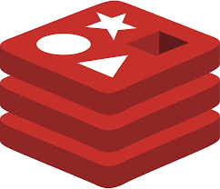

#  Lexxeous's Redis Management: 
### Manage your local Redis Server.

##### Start the Redis server.
```sh
# Start the server and exit cursor.
redis-server

# Start the server and persist cursor.
# You can append additional commands after the `&` if desired.
redis-server &
```

##### Stop the Redis server.
```sh
redis-cli shutdown
```

##### Monitor Redis processes.
```sh
# Monitor and exit cursor.
redis-cli monitor

# Monitor and persist cursor.
# You can append additional commands after the `&` if desired.
redis-cli monitor &
```